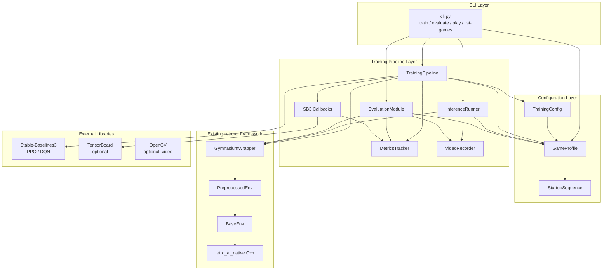
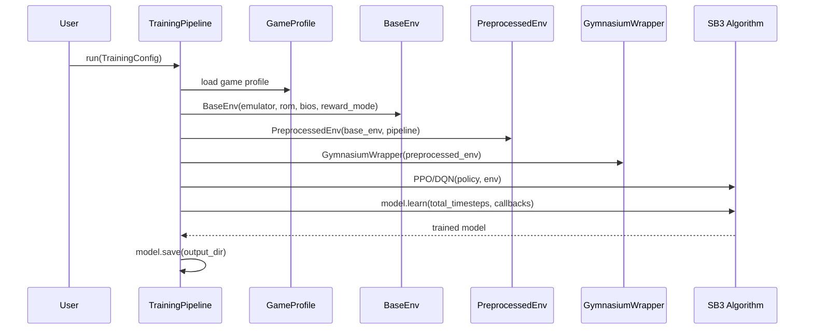
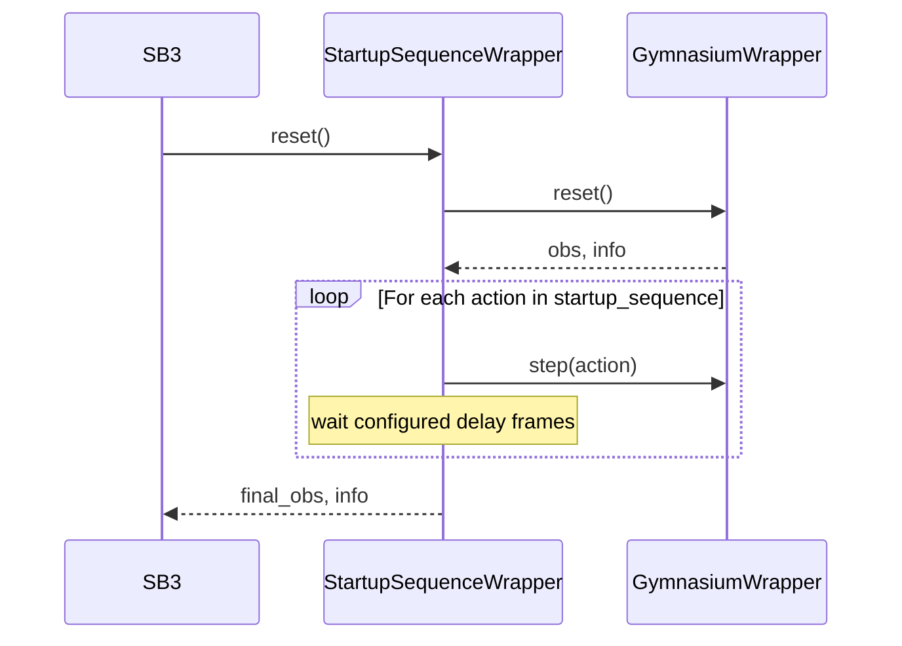
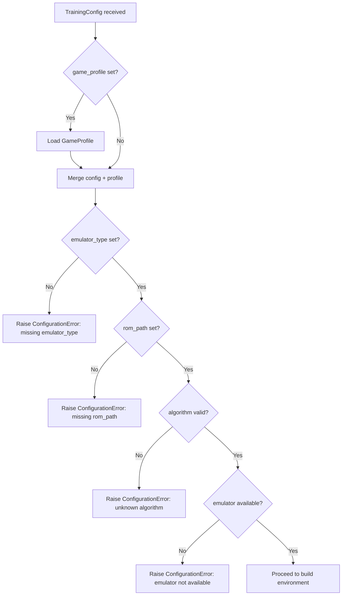

# Design Document: Agent Training Pipeline

## Overview

The Agent Training Pipeline is a pure-Python layer that sits on top of the existing retro-ai framework (BaseEnv, GymnasiumWrapper, PreprocessingPipeline) and provides end-to-end training, evaluation, and real-time inference for RL agents on retro game emulators. It uses Stable-Baselines3 as the RL backend and is fully game-agnostic — adding a new game or emulator requires only a YAML/JSON game profile, no code changes.

### Design Philosophy

1. **Zero Emulator Knowledge**: The pipeline interacts exclusively through BaseEnv/GymnasiumWrapper. No emulator-specific code exists in the training layer.
2. **Configuration-Driven**: Every aspect of a training run (algorithm, hyperparameters, preprocessing, reward, checkpointing) is captured in a single `TrainingConfig` that can be serialized and reproduced.
3. **Composable Callbacks**: Training instrumentation (logging, checkpointing, early-warning) is implemented as SB3 callbacks that can be mixed and matched.
4. **Graceful Degradation**: Optional dependencies (TensorBoard, video encoding) are detected at runtime; the pipeline works without them and logs warnings.
5. **CLI-First**: All major operations (train, evaluate, play, list-games) are accessible from the command line without writing Python.

### New Modules

All new code lives under `python/retro_ai/training/`:

```
python/retro_ai/training/
├── __init__.py
├── config.py          # TrainingConfig, AlgorithmConfig dataclasses
├── pipeline.py        # TrainingPipeline orchestrator
├── game_profile.py    # GameProfile, StartupSequence
├── callbacks.py       # MetricsCallback, CheckpointCallback, StagnationCallback
├── metrics.py         # MetricsTracker (CSV + JSON summary)
├── inference.py       # InferenceRunner (real-time 60 FPS playback)
├── evaluation.py      # EvaluationModule (multi-episode deterministic eval)
├── video.py           # VideoRecorder (optional MP4 recording)
└── cli.py             # argparse CLI entry points
```

Plus a game profiles directory:

```
game_profiles/
├── videopac_satellite_attack.yaml
└── README.md
```

## Architecture

### High-Level System Architecture



### Environment Construction Flow



### Startup Sequence Execution

The startup sequence runs after every `env.reset()` to navigate menus/title screens before gameplay begins. This is handled by wrapping the GymnasiumWrapper in a `StartupSequenceWrapper` that intercepts `reset()`.



## Components and Interfaces

### TrainingConfig (`training/config.py`)

```python
@dataclass
class AlgorithmConfig:
    """RL algorithm selection and hyperparameters."""
    name: str = "PPO"                          # "PPO" or "DQN"
    learning_rate: float = 3e-4
    batch_size: int = 64
    extra: Dict[str, Any] = field(default_factory=dict)  # algo-specific kwargs

@dataclass
class TrainingConfig:
    """Complete specification for a training run."""
    # Algorithm
    algorithm: AlgorithmConfig = field(default_factory=AlgorithmConfig)
    total_timesteps: int = 1_000_000

    # Environment (can be overridden by game_profile)
    emulator_type: Optional[str] = None
    rom_path: Optional[str] = None
    bios_path: Optional[str] = None
    reward_mode: str = "survival"
    reward_params: Dict[str, Any] = field(default_factory=dict)
    reward_weights: Optional[Dict[str, float]] = None  # multi-reward blending

    # Preprocessing
    grayscale: bool = True
    resize: Optional[Tuple[int, int]] = (84, 84)  # (H, W)
    frame_stack: int = 4
    frame_skip: int = 4

    # Game profile
    game_profile: Optional[str] = None  # profile name or path

    # Output
    output_dir: str = "output"
    checkpoint_interval: int = 50_000       # steps between checkpoints
    max_checkpoints: int = 5                # rolling window
    log_interval: int = 1_000               # steps between metric flushes

    # Metrics
    tensorboard: bool = False
    rolling_window: int = 100               # episodes for rolling average
    stagnation_threshold: int = 200_000     # steps without improvement → warning

    # Policy network
    policy: str = "CnnPolicy"
```

Key design decisions:
- `AlgorithmConfig.extra` is a catch-all dict for algorithm-specific kwargs (e.g. `n_steps` for PPO, `buffer_size` for DQN). This avoids an explosion of fields while still being serializable.
- `game_profile` can be a name (looked up from `game_profiles/`) or a file path. When set, its values fill in any `None` fields in TrainingConfig.
- Defaults are tuned for Atari-style training (84×84 grayscale, 4-frame stack, CnnPolicy).

#### Config Serialization

`TrainingConfigParser` extends the existing `ConfigParser` pattern:

```python
class TrainingConfigParser:
    @staticmethod
    def from_dict(data: dict) -> TrainingConfig: ...
    @staticmethod
    def from_yaml(path: str) -> TrainingConfig: ...
    @staticmethod
    def from_json(path: str) -> TrainingConfig: ...
    @staticmethod
    def to_dict(config: TrainingConfig) -> dict: ...
    @staticmethod
    def to_yaml(config: TrainingConfig, path: str) -> str: ...
    @staticmethod
    def to_json(config: TrainingConfig, path: str) -> str: ...
    @staticmethod
    def validate(config: TrainingConfig) -> None:
        """Raise ConfigurationError with field name if required fields are missing."""
```

Validation rules:
- `emulator_type` and `rom_path` must be non-None (either directly or via game_profile)
- `algorithm.name` must be in `{"PPO", "DQN"}`
- `total_timesteps` must be > 0
- `checkpoint_interval` must be > 0
- `resize` tuple elements must be > 0 when set

### GameProfile (`training/game_profile.py`)

```python
@dataclass
class StartupAction:
    """A single action in a startup sequence."""
    action: int              # discrete action index
    frames: int = 1          # hold for N frames

@dataclass
class StartupSequence:
    """Ordered list of actions to reach gameplay from boot."""
    actions: List[StartupAction] = field(default_factory=list)
    post_delay_frames: int = 60  # wait after sequence completes

@dataclass
class GameProfile:
    """Game-specific configuration."""
    name: str                                    # e.g. "satellite_attack"
    emulator_type: str                           # "videopac" or "mo5"
    rom_path: str
    bios_path: Optional[str] = None
    display_name: str = ""                       # human-readable
    action_count: Optional[int] = None           # override action space size
    reward_mode: str = "survival"
    reward_params: Dict[str, Any] = field(default_factory=dict)
    startup_sequence: Optional[StartupSequence] = None
    # Preprocessing defaults
    grayscale: bool = True
    resize: Optional[Tuple[int, int]] = (84, 84)
    frame_stack: int = 4
    frame_skip: int = 4

class GameProfileRegistry:
    """Discover and load game profiles from a directory."""
    def __init__(self, profile_dirs: Optional[List[str]] = None): ...
    def list_profiles(self) -> List[str]: ...
    def load(self, name_or_path: str) -> GameProfile: ...
```

Example `videopac_satellite_attack.yaml`:
```yaml
name: satellite_attack
display_name: "Satellite Attack (Videopac)"
emulator_type: videopac
rom_path: "C:/src/videopac/roms/Satellite Attack (1981)(Philips)(EU).bin"
bios_path: "C:/src/videopac/roms/o2rom.bin"
reward_mode: survival
startup_sequence:
  actions:
    - action: 1    # press "1" to select game
      frames: 10
  post_delay_frames: 120
grayscale: true
resize: [84, 84]
frame_stack: 4
frame_skip: 4
```

### StartupSequenceWrapper (`training/game_profile.py`)

A thin Gymnasium wrapper that executes the startup sequence on every `reset()`:

```python
class StartupSequenceWrapper(gym.Wrapper):
    def __init__(self, env: gym.Env, sequence: StartupSequence):
        super().__init__(env)
        self._sequence = sequence

    def reset(self, **kwargs):
        obs, info = self.env.reset(**kwargs)
        for action in self._sequence.actions:
            for _ in range(action.frames):
                obs, _, done, truncated, info = self.env.step(action.action)
                if done or truncated:
                    obs, info = self.env.reset(**kwargs)
                    break
        # Post-delay: step with no-op (action 0) for N frames
        for _ in range(self._sequence.post_delay_frames):
            obs, _, done, truncated, info = self.env.step(0)
            if done or truncated:
                break
        return obs, info
```

### TrainingPipeline (`training/pipeline.py`)

The main orchestrator:

```python
class TrainingPipeline:
    def __init__(self, config: TrainingConfig, logger: Optional[StructuredLogger] = None): ...

    def run(self) -> Path:
        """Execute full training run. Returns path to saved model."""
        self._validate_config()
        self._log_run_start()
        env = self._build_env()
        model = self._build_model(env)
        callbacks = self._build_callbacks()
        try:
            model.learn(
                total_timesteps=self.config.total_timesteps,
                callback=callbacks,
            )
        except KeyboardInterrupt:
            self._logger.warning("Training interrupted, saving current model")
        finally:
            model_path = self._save_model(model)
            self._metrics.write_summary()
        return model_path

    def resume(self, checkpoint_path: str) -> Path:
        """Resume training from a checkpoint."""
        ...

    def _build_env(self) -> gym.Env:
        """BaseEnv → PreprocessedEnv → GymnasiumWrapper → StartupSequenceWrapper"""
        ...

    def _build_model(self, env: gym.Env) -> BaseAlgorithm:
        """Instantiate PPO or DQN with config hyperparameters."""
        ...

    def _build_callbacks(self) -> CallbackList:
        """Assemble MetricsCallback + CheckpointCallback + StagnationCallback."""
        ...
```

Algorithm instantiation maps `AlgorithmConfig.name` to SB3 classes:

```python
ALGORITHM_MAP = {
    "PPO": PPO,
    "DQN": DQN,
}
```

### Callbacks (`training/callbacks.py`)

Three SB3 callbacks:

```python
class MetricsCallback(BaseCallback):
    """Logs episode metrics to MetricsTracker at configured intervals."""
    def __init__(self, metrics: MetricsTracker, log_interval: int): ...
    def _on_step(self) -> bool: ...

class CheckpointCallback(BaseCallback):
    """Saves model checkpoints with rolling deletion."""
    def __init__(self, save_path: str, interval: int, max_keep: int): ...
    def _on_step(self) -> bool: ...

class StagnationCallback(BaseCallback):
    """Warns when rolling average reward plateaus."""
    def __init__(self, metrics: MetricsTracker, threshold_steps: int): ...
    def _on_step(self) -> bool: ...
```

### MetricsTracker (`training/metrics.py`)

```python
class MetricsTracker:
    def __init__(self, output_dir: str, rolling_window: int = 100): ...

    def record_episode(self, reward: float, length: int, info: dict) -> None: ...
    def rolling_reward(self) -> Optional[float]: ...
    def rolling_length(self) -> Optional[float]: ...
    def best_reward(self) -> float: ...
    def flush_csv(self) -> None:
        """Append buffered episodes to CSV file."""
    def write_summary(self) -> None:
        """Write final JSON summary (total episodes, mean/best reward, duration)."""
    def load_existing(self, csv_path: str) -> None:
        """Resume from existing CSV when continuing from checkpoint."""
```

CSV columns: `episode, reward, length, score, timestamp`

Summary JSON structure:
```json
{
  "total_episodes": 1500,
  "total_timesteps": 1000000,
  "mean_reward": 42.3,
  "std_reward": 12.1,
  "best_reward": 98.0,
  "mean_length": 450,
  "wall_clock_seconds": 3600.5
}
```

### InferenceRunner (`training/inference.py`)

```python
class InferenceRunner:
    def __init__(
        self,
        model_path: str,
        game_profile: GameProfile,
        target_fps: float = 60.0,
        video_path: Optional[str] = None,
    ): ...

    def run(self, max_episodes: Optional[int] = None) -> None:
        """Run inference loop at target FPS."""
        env = self._build_env()
        model = self._load_model()
        recorder = self._maybe_init_recorder()
        skipped_frames = 0

        while True:
            obs, info = env.reset()
            done = False
            while not done:
                frame_start = time.perf_counter()
                action, _ = model.predict(obs, deterministic=True)
                obs, reward, done, truncated, info = env.step(action)
                done = done or truncated

                if recorder:
                    recorder.add_frame(obs)

                # Frame pacing
                elapsed = time.perf_counter() - frame_start
                budget = 1.0 / self._target_fps
                if elapsed < budget:
                    time.sleep(budget - elapsed)
                else:
                    skipped_frames += 1

            if skipped_frames > 0:
                self._logger.info(f"Skipped {skipped_frames} frames this episode")
                skipped_frames = 0

            if max_episodes is not None:
                max_episodes -= 1
                if max_episodes <= 0:
                    break
```

### EvaluationModule (`training/evaluation.py`)

```python
class EvaluationModule:
    def __init__(
        self,
        model_path: str,
        game_profile: GameProfile,
        num_episodes: int = 10,
        base_seed: int = 42,
        output_dir: str = "output",
        video_path: Optional[str] = None,
    ): ...

    def run(self) -> Dict[str, Any]:
        """Run deterministic evaluation, return summary stats."""
        env = self._build_env()
        model = self._load_model()
        results = []

        for ep in range(self.num_episodes):
            seed = self.base_seed + ep
            obs, info = env.reset(seed=seed)
            episode_reward = 0.0
            episode_length = 0
            done = False

            while not done:
                action, _ = model.predict(obs, deterministic=True)
                obs, reward, done, truncated, info = env.step(action)
                done = done or truncated
                episode_reward += reward
                episode_length += 1

            results.append({
                "episode": ep,
                "seed": seed,
                "reward": episode_reward,
                "length": episode_length,
                "score": info.get("score"),
            })

        summary = self._compute_summary(results)
        self._save_results(results, summary)
        return summary
```

Summary computation:
```python
def _compute_summary(self, results):
    rewards = [r["reward"] for r in results]
    lengths = [r["length"] for r in results]
    return {
        "num_episodes": len(results),
        "reward_mean": np.mean(rewards),
        "reward_std": np.std(rewards),
        "reward_min": np.min(rewards),
        "reward_max": np.max(rewards),
        "length_mean": np.mean(lengths),
        "length_std": np.std(lengths),
        "length_min": np.min(lengths),
        "length_max": np.max(lengths),
    }
```

### VideoRecorder (`training/video.py`)

```python
class VideoRecorder:
    """Optional MP4 recorder with graceful degradation."""

    def __init__(self, path: str, fps: float = 60.0, overlay: bool = False): ...
    def add_frame(self, frame: np.ndarray, reward: float = 0.0, step: int = 0) -> None: ...
    def close(self) -> None: ...

    @staticmethod
    def available() -> bool:
        """Check if cv2.VideoWriter is available."""
        try:
            import cv2
            return True
        except ImportError:
            return False
```

If `cv2` is not installed, `VideoRecorder.__init__` logs a warning and becomes a no-op. The overlay option uses `cv2.putText` to render reward/step count on frames.

### CLI (`training/cli.py`)

```python
def main():
    parser = argparse.ArgumentParser(prog="retro-ai", description="Retro-AI Training Pipeline")
    subparsers = parser.add_subparsers(dest="command")

    # train
    train_p = subparsers.add_parser("train", help="Train an RL agent")
    train_p.add_argument("config", help="Path to training config YAML/JSON")
    train_p.add_argument("--resume", help="Path to checkpoint to resume from")

    # evaluate
    eval_p = subparsers.add_parser("evaluate", help="Evaluate a trained agent")
    eval_p.add_argument("model", help="Path to trained model")
    eval_p.add_argument("--profile", required=True, help="Game profile name or path")
    eval_p.add_argument("--episodes", type=int, default=10)
    eval_p.add_argument("--seed", type=int, default=42)
    eval_p.add_argument("--output", default="output")

    # play
    play_p = subparsers.add_parser("play", help="Watch agent play in real-time")
    play_p.add_argument("model", help="Path to trained model")
    play_p.add_argument("--profile", required=True, help="Game profile name or path")
    play_p.add_argument("--fps", type=float, default=60.0)
    play_p.add_argument("--record", help="Path to save MP4 video")

    # list-games
    subparsers.add_parser("list-games", help="List available game profiles")

    args = parser.parse_args()
    # dispatch to appropriate handler...
```

Entry point in `pyproject.toml` / setup:
```
[project.scripts]
retro-ai = "retro_ai.training.cli:main"
```

## Data Models

### TrainingConfig Dataclass

| Field | Type | Default | Required | Description |
|-------|------|---------|----------|-------------|
| algorithm | AlgorithmConfig | PPO, lr=3e-4 | No | Algorithm selection and hyperparameters |
| total_timesteps | int | 1,000,000 | No | Total training steps |
| emulator_type | str \| None | None | Yes* | Emulator backend |
| rom_path | str \| None | None | Yes* | ROM file path |
| bios_path | str \| None | None | Conditional | Required for Videopac |
| reward_mode | str | "survival" | No | Reward system |
| reward_params | dict | {} | No | Reward-specific parameters |
| reward_weights | dict \| None | None | No | Multi-reward blending weights |
| grayscale | bool | True | No | Grayscale preprocessing |
| resize | (int,int) \| None | (84,84) | No | Resize dimensions (H,W) |
| frame_stack | int | 4 | No | Frame stacking count |
| frame_skip | int | 4 | No | Frame skip count |
| game_profile | str \| None | None | No | Profile name or path |
| output_dir | str | "output" | No | Output directory |
| checkpoint_interval | int | 50,000 | No | Steps between checkpoints |
| max_checkpoints | int | 5 | No | Max checkpoints to keep |
| log_interval | int | 1,000 | No | Steps between metric flushes |
| tensorboard | bool | False | No | Enable TensorBoard logging |
| rolling_window | int | 100 | No | Rolling average window |
| stagnation_threshold | int | 200,000 | No | Steps without improvement before warning |
| policy | str | "CnnPolicy" | No | SB3 policy class name |

*Required either directly or via game_profile.

### GameProfile Dataclass

| Field | Type | Default | Required | Description |
|-------|------|---------|----------|-------------|
| name | str | — | Yes | Unique profile identifier |
| emulator_type | str | — | Yes | Emulator backend |
| rom_path | str | — | Yes | ROM file path |
| bios_path | str \| None | None | Conditional | BIOS path |
| display_name | str | "" | No | Human-readable name |
| action_count | int \| None | None | No | Override action space |
| reward_mode | str | "survival" | No | Default reward mode |
| reward_params | dict | {} | No | Reward parameters |
| startup_sequence | StartupSequence \| None | None | No | Boot-to-gameplay actions |
| grayscale | bool | True | No | Default grayscale |
| resize | (int,int) \| None | (84,84) | No | Default resize |
| frame_stack | int | 4 | No | Default frame stack |
| frame_skip | int | 4 | No | Default frame skip |

### Config Merge Precedence

When a `TrainingConfig` references a `GameProfile`, fields are merged with this precedence:

1. Explicit `TrainingConfig` values (highest priority)
2. `GameProfile` values
3. `TrainingConfig` defaults (lowest priority)

A field is considered "explicitly set" if it differs from the dataclass default or is not None for Optional fields.

### Checkpoint File Layout

```
output/
├── checkpoints/
│   ├── model_step_50000.zip
│   ├── model_step_100000.zip
│   └── model_step_150000.zip
├── metrics.csv
├── summary.json
├── final_model.zip
└── config.yaml          # copy of TrainingConfig for reproducibility
```

### Evaluation Results JSON

```json
{
  "model_path": "output/final_model.zip",
  "game_profile": "satellite_attack",
  "num_episodes": 10,
  "base_seed": 42,
  "episodes": [
    {"episode": 0, "seed": 42, "reward": 55.0, "length": 320, "score": null}
  ],
  "summary": {
    "reward_mean": 42.3,
    "reward_std": 12.1,
    "reward_min": 18.0,
    "reward_max": 98.0,
    "length_mean": 450.2,
    "length_std": 85.3,
    "length_min": 210,
    "length_max": 680
  }
}
```

## Correctness Properties

*A property is a characteristic or behavior that should hold true across all valid executions of a system — essentially, a formal statement about what the system should do. Properties serve as the bridge between human-readable specifications and machine-verifiable correctness guarantees.*

### Property 1: TrainingConfig round-trip serialization

*For any* valid `TrainingConfig` object, serializing it to YAML (or JSON) and then parsing the result back should produce an equivalent `TrainingConfig`. This must hold for all three input formats (dict, JSON file, YAML file).

**Validates: Requirements 1.4, 2.7, 2.8**

### Property 2: TrainingConfig defaults for optional fields

*For any* set of values for the required fields only (`emulator_type`, `rom_path`), constructing a `TrainingConfig` should succeed and all optional fields should have their documented default values (e.g. `total_timesteps=1_000_000`, `grayscale=True`, `policy="CnnPolicy"`).

**Validates: Requirements 2.5**

### Property 3: TrainingConfig validation names missing fields

*For any* required field in `TrainingConfig`, if that field is missing (None or absent) and no `game_profile` supplies it, then `TrainingConfigParser.validate()` should raise a `ConfigurationError` whose message contains the name of the missing field.

**Validates: Requirements 2.6**

### Property 4: GameProfile round-trip serialization

*For any* valid `GameProfile` object, serializing it to YAML (or JSON) and then loading it back should produce an equivalent `GameProfile`, including the `StartupSequence` if present.

**Validates: Requirements 3.4**

### Property 5: Startup sequence executes correct number of steps

*For any* `StartupSequence` with N actions (each held for F_i frames) and a post-delay of D frames, wrapping an environment with `StartupSequenceWrapper` and calling `reset()` should call `env.step()` exactly `sum(F_i) + D` times (assuming no early termination).

**Validates: Requirements 3.3, 6.4**

### Property 6: Config merge precedence

*For any* `TrainingConfig` and `GameProfile` pair, after merging, every field that was explicitly set in the `TrainingConfig` should retain its `TrainingConfig` value, and every field that was not set should take the `GameProfile` value.

**Validates: Requirements 3.5, 10.2**

### Property 7: Checkpoint filename contains step number

*For any* positive integer step number, the generated checkpoint filename should contain that step number as a substring, and parsing the filename back should recover the original step number.

**Validates: Requirements 4.2**

### Property 8: Checkpoint rolling deletion retains most recent N

*For any* sequence of M checkpoint saves with `max_checkpoints=N`, the number of checkpoint files on disk should be `min(M, N)`, and they should be the N most recent ones (by step number).

**Validates: Requirements 4.4**

### Property 9: MetricsTracker records all episode fields

*For any* sequence of episodes recorded via `record_episode(reward, length, info)`, the tracker should store all episodes and each stored episode should contain the reward, length, and timestamp fields.

**Validates: Requirements 5.3**

### Property 10: Rolling average correctness

*For any* sequence of N episode rewards and a window size W, `rolling_reward()` should return the arithmetic mean of the last `min(N, W)` rewards. The same holds for `rolling_length()` with episode lengths.

**Validates: Requirements 5.4**

### Property 11: Evaluation produces correct episode count with required fields

*For any* episode count N ≥ 1, running the `EvaluationModule` should produce exactly N episode results, and each result should contain `reward`, `length`, and `score` fields.

**Validates: Requirements 7.1, 7.2**

### Property 12: Evaluation summary statistics match numpy

*For any* list of episode results with numeric rewards and lengths, the computed summary `reward_mean`, `reward_std`, `reward_min`, `reward_max` (and likewise for lengths) should match `numpy.mean`, `numpy.std`, `numpy.min`, `numpy.max` applied to the same data.

**Validates: Requirements 7.3**

### Property 13: Evaluation deterministic seeding

*For any* base seed S and episode count N, the EvaluationModule should use seeds `[S, S+1, S+2, ..., S+N-1]` for the N episodes respectively.

**Validates: Requirements 7.4**

### Property 14: Metrics CSV persistence and append on resume

*For any* two sequences of episodes A and B, if A is recorded and flushed, then `load_existing()` is called, then B is recorded and flushed, the resulting CSV should contain all episodes from A followed by all episodes from B, in order.

**Validates: Requirements 8.1, 8.4**

### Property 15: Metrics summary JSON contains correct statistics

*For any* sequence of recorded episodes, `write_summary()` should produce a JSON file where `total_episodes` equals the episode count, `mean_reward` equals the mean of all rewards, and `best_reward` equals the maximum reward.

**Validates: Requirements 8.3**

### Property 16: Weighted reward combination

*For any* set of reward mode values and corresponding non-negative weights, the combined reward should equal the weighted sum: `sum(weight_i * reward_i)`.

**Validates: Requirements 10.3**

### Property 17: Video overlay modifies frame

*For any* RGB frame (H×W×3 uint8 array), when overlay is enabled and `add_frame()` is called with a non-zero reward or step count, the output frame should differ from the input frame (the overlay text was rendered).

**Validates: Requirements 11.3**

## Error Handling

### Error Categories

| Category | Exception | Trigger | Recovery |
|----------|-----------|---------|----------|
| Missing config field | `ConfigurationError` | Required field absent in TrainingConfig | User fixes config file |
| Invalid algorithm | `ConfigurationError` | Algorithm name not in {PPO, DQN} | User corrects algorithm name |
| Unknown emulator | `ConfigurationError` | Emulator type not recognized by BaseEnv | User corrects emulator_type |
| Missing ROM/BIOS | `InitializationError` | File path doesn't exist | User provides correct path |
| Game profile not found | `ConfigurationError` | Profile name not in registry | User checks `list-games` |
| Corrupted checkpoint | `StateError` | Checkpoint file unreadable | Fall back to previous valid checkpoint |
| Missing optional dep | Warning (logged) | TensorBoard or cv2 not installed | Continue without feature |
| Keyboard interrupt | Graceful shutdown | User presses Ctrl+C during training | Save model, flush metrics, exit |
| Disk full | `OSError` | Cannot write checkpoint/metrics | Log error, continue training |

### Graceful Degradation Strategy

1. **TensorBoard**: Check `tensorboard` availability at pipeline init. If unavailable and `config.tensorboard=True`, log warning and disable.
2. **Video recording**: `VideoRecorder.available()` checks for `cv2`. If unavailable, log warning and skip recording.
3. **Checkpoint corruption**: On `model.load()` failure, iterate backwards through checkpoint files until a valid one is found. If none valid, raise `StateError`.
4. **Keyboard interrupt**: The `try/except KeyboardInterrupt` in `TrainingPipeline.run()` ensures the model is saved and metrics flushed before exit.

### Validation Flow



## Testing Strategy

### Dual Testing Approach

The pipeline uses both unit tests and property-based tests for comprehensive coverage:

- **Unit tests**: Verify specific examples, edge cases, integration points, and error conditions. Used for CLI parsing, callback registration, TensorBoard detection, video graceful degradation, and emulator integration.
- **Property-based tests**: Verify universal properties across randomly generated inputs. Used for config serialization round-trips, merge precedence, metrics computation, checkpoint management, and evaluation statistics.

### Property-Based Testing Configuration

- **Library**: [Hypothesis](https://hypothesis.readthedocs.io/) for Python
- **Minimum iterations**: 100 per property test (via `@settings(max_examples=100)`)
- **Tag format**: Each property test includes a comment referencing the design property:
  ```python
  # Feature: agent-training-pipeline, Property 1: TrainingConfig round-trip serialization
  ```
- **Each correctness property is implemented by a single property-based test function**

### Test Organization

```
tests/python/test_training/
├── test_config.py           # Properties 1, 2, 3 + unit tests for config fields
├── test_game_profile.py     # Properties 4, 5, 6 + unit tests for profile loading
├── test_checkpoint.py       # Properties 7, 8 + edge case for corruption
├── test_metrics.py          # Properties 9, 10, 14, 15 + unit tests for CSV format
├── test_evaluation.py       # Properties 11, 12, 13 + unit tests for JSON output
├── test_reward.py           # Property 16 + unit tests for single reward modes
├── test_video.py            # Property 17 + edge case for missing cv2
├── test_cli.py              # Unit tests for CLI argument parsing
└── test_pipeline.py         # Integration tests for full pipeline (requires emulator)
```

### Unit Test Focus Areas

- CLI command parsing and error messages (Req 12.1–12.5)
- Callback registration and SB3 integration (Req 5.1, 5.2)
- TensorBoard availability detection (Req 5.2)
- Video recorder graceful degradation when cv2 missing (Req 11.4)
- Emulator type validation (Req 9.4, 9.5)
- Keyboard interrupt handling (Req 1.6)
- Checkpoint corruption fallback (Req 4.5)
- Stagnation warning trigger (Req 5.5)

### Dependencies

Required:
- `stable-baselines3` (PPO, DQN algorithms)
- `gymnasium` (environment interface)
- `numpy` (array operations)
- `hypothesis` (property-based testing)
- `pytest` (test runner)

Optional:
- `tensorboard` (training visualization)
- `opencv-python` (video recording)
- `pyyaml` (YAML config support)
