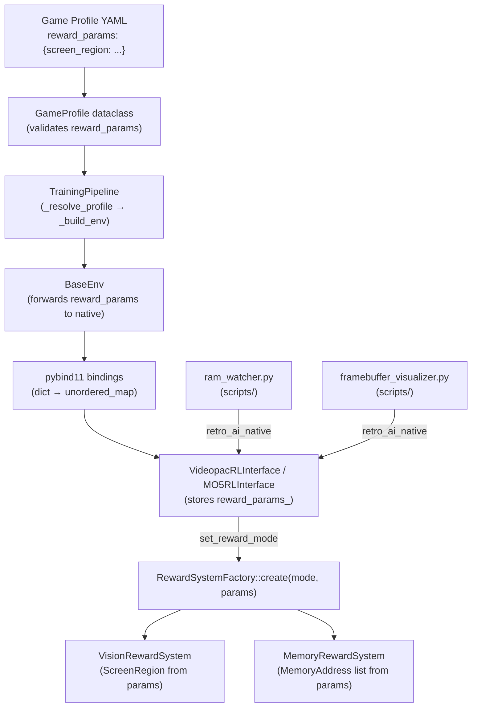

# Design Document: Game Reward Discovery

## Overview

This feature adds per-game reward parameter configuration and discovery tooling to the retro-ai framework. Currently, the `RewardSystemFactory` hardcodes a single `ScreenRegion` for vision mode and the `MemoryRewardSystem` has no way to receive RAM addresses from game profiles. The `reward_params` field exists on `GameProfile` but is never forwarded to the C++ layer.

The design threads `reward_params` from YAML game profiles through the Python pipeline (`GameProfile` → `TrainingPipeline` → `BaseEnv` → pybind11 bindings → `RLInterface` → `RewardSystemFactory`) into the C++ reward system constructors. It also adds two interactive discovery scripts that help researchers find score locations in RAM and on screen.

### Key Design Decisions

1. **String-based parameter map at the C++ boundary**: The `RewardSystemFactory::create` overload accepts `std::unordered_map<std::string, std::string>` rather than typed structs. This keeps the pybind11 conversion simple (Python `dict[str, str]`) and avoids coupling the factory interface to specific reward system types.

2. **Validation at the Python layer**: `GameProfile._deserialize` validates `reward_params` types and ranges before they cross the Python→C++ boundary. The C++ side does `stoi`/`stoul` conversion with fallback to defaults, but the primary validation gate is Python.

3. **Backward-compatible factory**: The existing parameterless `RewardSystemFactory::create(mode)` remains unchanged. A new overload `create(mode, params)` is added. Existing code that doesn't pass params continues to work.

4. **Discovery scripts are standalone**: `ram_watcher.py` and `framebuffer_visualizer.py` live in `scripts/` alongside existing debug scripts. They use `retro_ai_native` directly (not the training pipeline) for minimal dependencies.

## Architecture



### Data Flow

1. User writes `reward_params` in a YAML game profile
2. `GameProfile._deserialize` parses and validates the params
3. `TrainingPipeline._build_env` passes `reward_params` into `BaseEnv` config
4. `BaseEnv._create_interface` flattens the nested dict into string key-value pairs and passes them to the native constructor
5. `VideopacRLInterface::Impl` stores the param map
6. When `set_reward_mode` is called (or during construction), the param map is forwarded to `RewardSystemFactory::create(mode, params)`
7. The factory parses relevant keys and constructs the reward system with the appropriate configuration

## Components and Interfaces

### 1. GameProfile Validation (Python)

**File**: `python/retro_ai/training/game_profile.py`

Add validation logic in `_deserialize` for `reward_params`:

```python
@staticmethod
def _validate_reward_params(reward_params: Dict[str, Any], reward_mode: str) -> None:
    """Validate reward_params values. Raises ConfigurationError on invalid input."""
    if "screen_region" in reward_params:
        region = reward_params["screen_region"]
        for key in ("x", "y", "width", "height"):
            val = region.get(key)
            if val is not None and (not isinstance(val, int) or val < 0):
                raise ConfigurationError(
                    f"screen_region.{key} must be a non-negative integer, got {val!r}"
                )
    if "score_addresses" in reward_params:
        for i, entry in enumerate(reward_params["score_addresses"]):
            addr = entry.get("address", 0)
            if not isinstance(addr, int) or addr < 0 or addr > 65535:
                raise ConfigurationError(
                    f"score_addresses[{i}].address must be in [0, 65535], got {addr!r}"
                )
            nb = entry.get("num_bytes", 1)
            if nb not in (1, 2, 4):
                raise ConfigurationError(
                    f"score_addresses[{i}].num_bytes must be 1, 2, or 4, got {nb!r}"
                )
```

### 2. BaseEnv Parameter Forwarding (Python)

**File**: `python/retro_ai/envs/base_env.py`

Modify `_create_interface` to flatten `reward_params` from the config dict into a string map and pass it to the native constructor:

```python
@staticmethod
def _flatten_reward_params(reward_params: Dict[str, Any]) -> Dict[str, str]:
    """Flatten nested reward_params into a string key-value map for C++."""
    flat = {}
    if "screen_region" in reward_params:
        sr = reward_params["screen_region"]
        for key in ("x", "y", "width", "height"):
            if key in sr:
                flat[f"screen_region_{key[0]}"] = str(sr[key])
        # Map width→w, height→h for C++ convention
        if "width" in sr:
            flat["screen_region_w"] = str(sr["width"])
        if "height" in sr:
            flat["screen_region_h"] = str(sr["height"])
    if "score_addresses" in reward_params:
        for i, entry in enumerate(reward_params["score_addresses"]):
            flat[f"score_address_{i}_addr"] = str(entry["address"])
            flat[f"score_address_{i}_bytes"] = str(entry.get("num_bytes", 1))
            flat[f"score_address_{i}_bcd"] = str(int(entry.get("is_bcd", False)))
        flat["score_address_count"] = str(len(reward_params["score_addresses"]))
    return flat
```

### 3. RewardSystemFactory Overload (C++)

**File**: `src/reward_systems.cpp`, `include/retro_ai/reward_system.hpp`

Add a new `create` overload:

```cpp
// In reward_system.hpp
using RewardParams = std::unordered_map<std::string, std::string>;

class RewardSystemFactory {
public:
    static std::unique_ptr<RewardSystem> create(const std::string& mode);
    static std::unique_ptr<RewardSystem> create(const std::string& mode,
                                                 const RewardParams& params);
    static std::vector<std::string> available_modes();
};
```

The parameterized `create` parses `screen_region_x/y/w/h` for vision mode and `score_address_*` entries for memory mode. If keys are missing, it falls back to the same defaults as the parameterless version.

### 4. RLInterface Parameter Storage (C++)

**Files**: `include/retro_ai/videopac_rl.hpp`, `src/videopac_rl.cpp`, `include/retro_ai/mo5_rl.hpp`, `src/mo5_rl.cpp`

Add an optional `RewardParams` to each constructor. Store it in the `Impl` class. Forward it to `RewardSystemFactory::create(mode, params)` in `set_reward_mode`.

```cpp
// videopac_rl.hpp — new constructor overload
explicit VideopacRLInterface(const std::string& bios_path,
                              const std::string& rom_path,
                              const std::string& reward_mode = "survival",
                              int joystick_index = 0,
                              const RewardParams& reward_params = {});
```

### 5. Python Bindings Update

**File**: `python/bindings.cpp`

Add the `reward_params` parameter to both `VideopacRLInterface` and `MO5RLInterface` constructors:

```cpp
py::class_<VideopacRLInterface, RLInterface, std::shared_ptr<VideopacRLInterface>>(
        m, "VideopacRLInterface")
    .def(py::init<const std::string&, const std::string&, const std::string&,
                   int, const RewardParams&>(),
         py::arg("bios_path"),
         py::arg("rom_path"),
         py::arg("reward_mode") = "survival",
         py::arg("joystick_index") = 0,
         py::arg("reward_params") = RewardParams{},
         "Create a Videopac (Odyssey 2) environment.");
```

### 6. RAM Watcher Script

**File**: `scripts/ram_watcher.py`

Interactive CLI tool that:
- Creates an emulator via `retro_ai_native`
- Captures full RAM snapshots each frame using a memory reader callback
- On keypress (`m`), marks the current snapshot and diffs against the previous mark
- Displays changed addresses with old/new values in decimal and hex
- Tracks monotonically increasing addresses across multiple marks
- Outputs YAML-compatible `score_addresses` format

The Videopac emulator exposes RAM via its VDC/memory interfaces. The script will use a `read_ram` method exposed through a new thin binding that reads a range of RAM addresses.

### 7. Framebuffer Visualizer Script

**File**: `scripts/framebuffer_visualizer.py`

Interactive GUI tool (using Pillow/tkinter or pygame) that:
- Creates an emulator via `retro_ai_native`
- Renders the framebuffer scaled up for visibility
- Allows click-and-drag rectangle selection
- Shows coordinates in native emulator resolution in real-time
- Supports frame-by-frame stepping (spacebar)
- Outputs YAML-compatible `screen_region` format on confirmation


## Data Models

### YAML Schema: Vision Reward Params

```yaml
reward_mode: vision
reward_params:
  screen_region:
    x: 112        # left edge in pixels (non-negative int)
    y: 80         # top edge in pixels (non-negative int)
    width: 40     # region width in pixels (non-negative int)
    height: 14    # region height in pixels (non-negative int)
```

### YAML Schema: Memory Reward Params

```yaml
reward_mode: memory
reward_params:
  score_addresses:
    - address: 0x003A    # RAM address (0–65535)
      num_bytes: 1       # 1, 2, or 4
      is_bcd: true       # BCD-encoded?
    - address: 0x003B
      num_bytes: 1
      is_bcd: true
```

### C++ Parameter Map (Flattened)

The Python layer flattens nested `reward_params` into a flat `std::unordered_map<std::string, std::string>`:

| Key | Example Value | Description |
|-----|---------------|-------------|
| `screen_region_x` | `"112"` | Vision: left edge |
| `screen_region_y` | `"80"` | Vision: top edge |
| `screen_region_w` | `"40"` | Vision: width |
| `screen_region_h` | `"14"` | Vision: height |
| `score_address_count` | `"2"` | Memory: number of address entries |
| `score_address_0_addr` | `"58"` | Memory: first address (decimal) |
| `score_address_0_bytes` | `"1"` | Memory: byte count |
| `score_address_0_bcd` | `"1"` | Memory: BCD flag (0 or 1) |

### Python GameProfile.reward_params

The `reward_params` field on `GameProfile` remains `Dict[str, Any]`. No new dataclass is introduced — the validation happens in `_validate_reward_params` and the flattening happens in `BaseEnv._flatten_reward_params`.

### Existing C++ Structs (Unchanged)

```cpp
// vision.hpp
struct ScreenRegion {
    int x, y, width, height;
};

// memory.hpp
struct MemoryAddress {
    uint16_t address;
    int num_bytes;
    bool is_bcd;
};
```

These structs are constructed by the `RewardSystemFactory` from the flattened parameter map. No changes to the structs themselves.

### Default Values

| Parameter | Default | Source |
|-----------|---------|--------|
| `screen_region` | `{112, 80, 40, 14}` | Current hardcoded value in `reward_systems.cpp` |
| `score_addresses` | `[]` (empty) | `MemoryRewardSystem` default constructor |
| `num_bytes` | `1` | Per-entry default |
| `is_bcd` | `false` | Per-entry default |


## Correctness Properties

*A property is a characteristic or behavior that should hold true across all valid executions of a system — essentially, a formal statement about what the system should do. Properties serve as the bridge between human-readable specifications and machine-verifiable correctness guarantees.*

### Property 1: GameProfile reward_params round-trip

*For any* valid `reward_params` dictionary containing a `screen_region` with non-negative integer fields (x, y, width, height) and/or a `score_addresses` list with valid entries (address in [0, 65535], num_bytes in {1, 2, 4}, is_bcd boolean), serializing the GameProfile to a YAML string and deserializing it back should produce a GameProfile with an equivalent `reward_params` dictionary.

**Validates: Requirements 1.1, 2.1**

### Property 2: Screen region validation accepts non-negative and rejects negative

*For any* integer value for each of x, y, width, and height in a `screen_region`, the GameProfile validation should accept the value if and only if it is a non-negative integer. Negative values should cause a `ConfigurationError` to be raised.

**Validates: Requirements 1.2, 1.3**

### Property 3: Score addresses validation

*For any* `score_addresses` entry, the GameProfile validation should accept the entry if and only if `address` is an integer in [0, 65535] and `num_bytes` is one of {1, 2, 4}. Entries with `address` outside [0, 65535] or `num_bytes` not in {1, 2, 4} should cause a `ConfigurationError`.

**Validates: Requirements 2.2, 2.3, 2.4**

### Property 4: Factory creates VisionRewardSystem with custom ScreenRegion

*For any* valid non-negative integer values for screen_region_x, screen_region_y, screen_region_w, and screen_region_h in the parameter map, `RewardSystemFactory::create("vision", params)` should construct a VisionRewardSystem whose score region matches those values.

**Validates: Requirements 4.2**

### Property 5: Factory creates MemoryRewardSystem with custom addresses

*For any* valid set of score address entries in the parameter map (with address in [0, 65535], num_bytes in {1, 2, 4}, and is_bcd in {0, 1}), `RewardSystemFactory::create("memory", params)` should construct a MemoryRewardSystem whose address list matches those entries.

**Validates: Requirements 4.3**

### Property 6: RAM snapshot diff correctness

*For any* two RAM snapshots (byte arrays of equal length), computing the diff should return exactly the set of addresses where the two snapshots differ, and for each changed address the reported old and new values should match the actual byte values at that address in the respective snapshots. The display should include both decimal and hexadecimal representations.

**Validates: Requirements 6.3, 6.4**

### Property 7: Monotonic address filtering

*For any* sequence of three or more RAM snapshots, the monotonic filter should return exactly those addresses whose values strictly increased across every consecutive pair of snapshots.

**Validates: Requirements 6.5**

### Property 8: RAM watcher YAML output round-trip

*For any* set of discovered memory addresses (address in [0, 65535], num_bytes in {1, 2, 4}, is_bcd boolean), the RAM watcher's YAML output should be parseable by `yaml.safe_load` and produce a `score_addresses` list equivalent to the input addresses.

**Validates: Requirements 6.6**

### Property 9: Framebuffer visualizer coordinate scaling

*For any* positive integer scale factor and any pixel coordinate (px, py) in the scaled display space, converting to native emulator resolution via `(px // scale, py // scale)` should produce coordinates within the native framebuffer bounds, and the round-trip `native_to_scaled(scaled_to_native(px, py))` should produce coordinates within one pixel of the original.

**Validates: Requirements 7.6**

### Property 10: Framebuffer visualizer YAML output round-trip

*For any* valid screen region (non-negative x, y, width, height within emulator framebuffer bounds), the visualizer's YAML output should be parseable by `yaml.safe_load` and produce a `screen_region` dictionary equivalent to the input coordinates.

**Validates: Requirements 7.5**

### Property 11: Reward params flattening round-trip

*For any* valid `reward_params` dictionary, flattening it to a string map via `BaseEnv._flatten_reward_params` and then reconstructing the structured params from the flat map (as the C++ factory does) should produce equivalent configuration values.

**Validates: Requirements 3.1, 3.2**

## Error Handling

### Python Layer

| Error Condition | Exception | Location |
|----------------|-----------|----------|
| Negative `screen_region` value | `ConfigurationError` | `GameProfile._validate_reward_params` |
| `address` outside [0, 65535] | `ConfigurationError` | `GameProfile._validate_reward_params` |
| `num_bytes` not in {1, 2, 4} | `ConfigurationError` | `GameProfile._validate_reward_params` |
| Non-integer `screen_region` field | `ConfigurationError` | `GameProfile._validate_reward_params` |
| Unknown `emulator_type` | `ValueError` | `BaseEnv._create_interface` (existing) |
| Missing `bios_path` for Videopac | `ValueError` | `BaseEnv._create_interface` (existing) |

### C++ Layer

| Error Condition | Behavior | Location |
|----------------|----------|----------|
| Invalid string-to-int conversion in params | Fall back to default value | `RewardSystemFactory::create(mode, params)` |
| Unknown reward mode | Return `nullptr` | `RewardSystemFactory::create` (existing) |
| Empty `score_addresses` with memory mode | Return 0.0 reward | `MemoryRewardSystem::compute_reward` (existing) |

### Discovery Scripts

| Error Condition | Behavior | Location |
|----------------|----------|----------|
| Emulator doesn't support RAM reading | Print error message and exit | `ram_watcher.py` |
| Invalid game profile path | Print error and exit with non-zero code | Both scripts |
| No ROM/BIOS found | Print error and exit with non-zero code | Both scripts |
| Pillow/tkinter not installed | Print install instructions and exit | `framebuffer_visualizer.py` |

## Testing Strategy

### Property-Based Tests

Use **Hypothesis** (Python) for property-based testing. Each property test runs a minimum of 100 iterations.

| Property | Test File | Strategy |
|----------|-----------|----------|
| P1: reward_params round-trip | `tests/test_game_profile_props.py` | Generate random valid reward_params dicts, serialize GameProfile to YAML string, deserialize, compare |
| P2: screen_region validation | `tests/test_game_profile_props.py` | Generate random integers (positive and negative), validate, check accept/reject |
| P3: score_addresses validation | `tests/test_game_profile_props.py` | Generate random address/num_bytes/is_bcd combos, validate, check accept/reject |
| P4: Factory vision params | `tests/test_reward_factory_props.cpp` | Generate random non-negative ints, create via factory, inspect ScreenRegion |
| P5: Factory memory params | `tests/test_reward_factory_props.cpp` | Generate random valid addresses, create via factory, inspect MemoryAddress list |
| P6: RAM diff correctness | `tests/test_ram_watcher_props.py` | Generate random byte arrays, compute diff, verify correctness |
| P7: Monotonic filtering | `tests/test_ram_watcher_props.py` | Generate random snapshot sequences, filter, verify monotonicity |
| P8: RAM watcher YAML output | `tests/test_ram_watcher_props.py` | Generate random addresses, format as YAML, parse back, compare |
| P9: Coordinate scaling | `tests/test_visualizer_props.py` | Generate random scale factors and coordinates, verify conversion |
| P10: Visualizer YAML output | `tests/test_visualizer_props.py` | Generate random regions, format as YAML, parse back, compare |
| P11: Flatten round-trip | `tests/test_base_env_props.py` | Generate random reward_params, flatten, reconstruct, compare |

### Unit Tests

Unit tests cover specific examples, edge cases, and integration points:

| Test | File | What it covers |
|------|------|----------------|
| Default vision region | `tests/test_reward_systems.py` | Req 1.4: absent screen_region uses defaults |
| Default memory behavior | `tests/test_reward_systems.py` | Req 2.5: absent addresses returns 0.0 |
| Pipeline passes reward_params | `tests/test_pipeline.py` | Req 3.1: integration wiring |
| BaseEnv forwards params | `tests/test_base_env.py` | Req 3.2: config forwarding |
| Bindings accept params | `tests/test_bindings.py` | Req 3.3, 3.4: constructor signatures |
| Factory backward compat | `tests/test_reward_systems.py` | Req 4.4, 4.5: parameterless create still works |
| RAM watcher CLI args | `tests/test_ram_watcher.py` | Req 6.1: argument parsing |
| RAM watcher no-RAM error | `tests/test_ram_watcher.py` | Req 6.7: error reporting |
| Visualizer CLI args | `tests/test_visualizer.py` | Req 7.1: argument parsing |
| Example profiles exist | `tests/test_game_profiles.py` | Req 8.3, 8.4: file existence |

### Test Configuration

- Python property tests: Hypothesis with `@settings(max_examples=100)`
- C++ property tests: Use [RapidCheck](https://github.com/emil-e/rapidcheck) with `rc::prop` and 100 iterations
- Each property test includes a comment tag: `# Feature: game-reward-discovery, Property {N}: {title}`
- CI runs both unit and property test suites
