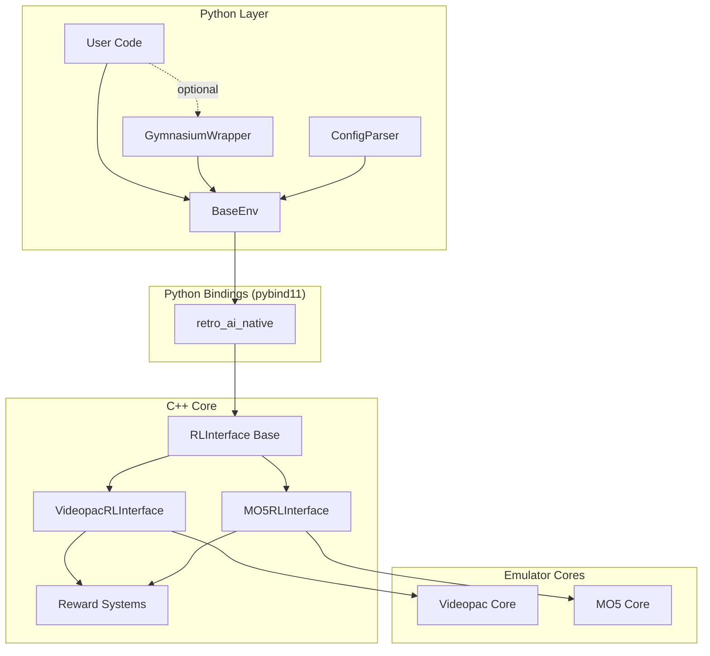
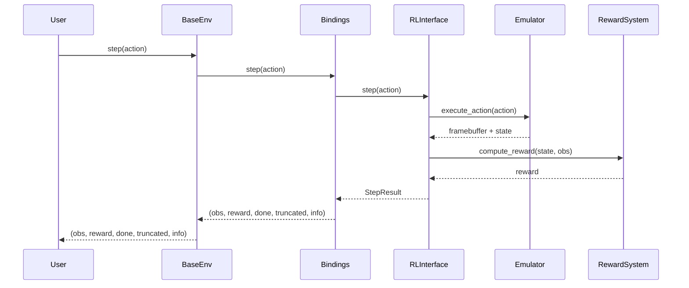
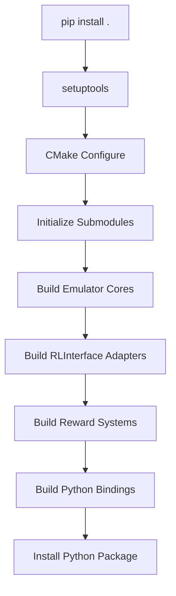

# Design Document: Retro-AI Framework

## Overview

The Retro-AI framework is a high-performance reinforcement learning platform for training AI agents on retro game emulators. The architecture follows a layered design with a C++ core for performance-critical operations and Python bindings for ease of use and integration with the ML ecosystem.

### Design Philosophy

1. **Framework Agnostic**: The core environment (BaseEnv) has no dependencies on specific RL frameworks, allowing users to integrate with any training library or implement custom training loops
2. **Performance First**: C++ core handles emulation and reward computation with minimal overhead (<5% from Python bindings)
3. **Pluggable Components**: Reward systems, emulators, and preprocessing modules are designed as interchangeable components
4. **Zero-Copy Where Possible**: NumPy arrays share memory with C++ vectors to minimize data transfer overhead
5. **Deterministic by Default**: All components support seeding for reproducible experiments

### Key Components

- **C++ RLInterface**: Abstract base class defining the contract for all emulator adapters
- **Emulator Adapters**: Concrete implementations (VideopacRLInterface, MO5RLInterface) that wrap emulator cores
- **Reward Systems**: Pluggable reward computation modules (survival, memory-based, vision-based, intrinsic)
- **Python BaseEnv**: Framework-agnostic environment wrapper exposing a simple step/reset API
- **Optional Gymnasium Wrapper**: Adapter for compatibility with Gymnasium-based libraries
- **Build System**: CMake + setuptools integration for cross-platform compilation and packaging

## Architecture

### High-Level System Architecture




### Component Interaction Flow

1. **Initialization**: User creates BaseEnv with config → BaseEnv loads C++ RLInterface via bindings → RLInterface initializes emulator core and reward system
2. **Reset**: BaseEnv.reset() → RLInterface.reset() → Emulator core resets → Returns initial observation as NumPy array
3. **Step**: BaseEnv.step(action) → RLInterface.step(action) → Emulator advances one frame → Reward system computes reward → Returns (obs, reward, done, truncated, info)
4. **State Management**: save_state() → Serializes complete emulator state → Returns bytes; load_state(bytes) → Restores exact state

### Data Flow



## Components and Interfaces

### C++ Core Components

#### RLInterface (Abstract Base Class)

The RLInterface defines the contract that all emulator adapters must implement. It uses only standard C++ types to ensure ABI stability across compilers.

**Header: include/retro_ai/rl_interface.hpp**

```cpp
namespace retro_ai {

// Data structures
struct ObservationSpace {
    int width;
    int height;
    int channels;  // 1 for grayscale, 3 for RGB
    int bits_per_channel;  // typically 8
};

enum class ActionType {
    DISCRETE,
    MULTI_DISCRETE,
    CONTINUOUS
};

struct ActionSpace {
    ActionType type;
    std::vector<int> shape;  // For discrete: [n_actions], multi-discrete: [n1, n2, ...], continuous: [dim]
};

struct StepResult {
    std::vector<uint8_t> observation;  // Flattened pixel data
    float reward;
    bool done;
    bool truncated;
    std::string info;  // JSON-encoded metadata
};

// Abstract interface
class RLInterface {
public:
    virtual ~RLInterface() = default;
    
    // Core RL methods
    virtual StepResult reset(int seed = -1) = 0;
    virtual StepResult step(const std::vector<int>& action) = 0;
    
    // Space queries
    virtual ObservationSpace observation_space() const = 0;
    virtual ActionSpace action_space() const = 0;
    
    // State management
    virtual std::vector<uint8_t> save_state() const = 0;
    virtual void load_state(const std::vector<uint8_t>& state) = 0;
    
    // Reward configuration
    virtual void set_reward_mode(const std::string& mode) = 0;
    virtual std::vector<std::string> available_reward_modes() const = 0;
    
    // Metadata
    virtual std::string emulator_name() const = 0;
    virtual std::string game_name() const = 0;
};

}  // namespace retro_ai
```


#### Emulator Adapter Implementations

**VideopacRLInterface**

Wraps the Videopac (Odyssey 2) emulator core. The implementation manages the emulator lifecycle, extracts framebuffer data, and coordinates with the reward system.

**Header: include/retro_ai/videopac_rl.hpp**

```cpp
namespace retro_ai {

class VideopacRLInterface : public RLInterface {
public:
    explicit VideopacRLInterface(const std::string& bios_path, 
                                  const std::string& rom_path,
                                  const std::string& reward_mode = "survival");
    ~VideopacRLInterface() override;
    
    // RLInterface implementation
    StepResult reset(int seed = -1) override;
    StepResult step(const std::vector<int>& action) override;
    ObservationSpace observation_space() const override;
    ActionSpace action_space() const override;
    std::vector<uint8_t> save_state() const override;
    void load_state(const std::vector<uint8_t>& state) override;
    void set_reward_mode(const std::string& mode) override;
    std::vector<std::string> available_reward_modes() const override;
    std::string emulator_name() const override { return "Videopac"; }
    std::string game_name() const override;
    
private:
    class Impl;  // PIMPL pattern to hide emulator details
    std::unique_ptr<Impl> impl_;
};

}  // namespace retro_ai
```

**MO5RLInterface**

Similar structure to VideopacRLInterface but wraps the Thomson MO5 emulator.

**Header: include/retro_ai/mo5_rl.hpp**

```cpp
namespace retro_ai {

class MO5RLInterface : public RLInterface {
public:
    explicit MO5RLInterface(const std::string& rom_path,
                            const std::string& reward_mode = "survival");
    ~MO5RLInterface() override;
    
    // RLInterface implementation (same signature as VideopacRLInterface)
    StepResult reset(int seed = -1) override;
    StepResult step(const std::vector<int>& action) override;
    ObservationSpace observation_space() const override;
    ActionSpace action_space() const override;
    std::vector<uint8_t> save_state() const override;
    void load_state(const std::vector<uint8_t>& state) override;
    void set_reward_mode(const std::string& mode) override;
    std::vector<std::string> available_reward_modes() const override;
    std::string emulator_name() const override { return "MO5"; }
    std::string game_name() const override;
    
private:
    class Impl;
    std::unique_ptr<Impl> impl_;
};

}  // namespace retro_ai
```

**Implementation Notes**:
- Both adapters use PIMPL (Pointer to Implementation) pattern to hide emulator-specific details
- Emulator cores run in headless mode (no SDL, no graphics output)
- Framebuffer is extracted as raw RGB888 format (width × height × 3 bytes)
- Action mapping converts discrete action indices to button states
- State serialization captures complete emulator RAM, registers, and internal state


#### Reward System Architecture

The reward system is designed as a pluggable component with multiple implementations. Each reward system implements a common interface and can be selected at runtime.

**Header: include/retro_ai/reward_system.hpp**

```cpp
namespace retro_ai {

// Forward declarations
struct ObservationSpace;
struct StepResult;

class RewardSystem {
public:
    virtual ~RewardSystem() = default;
    
    // Compute reward from current state
    virtual float compute_reward(const std::vector<uint8_t>& observation,
                                  const std::vector<uint8_t>& prev_observation,
                                  bool done,
                                  const std::string& info) = 0;
    
    // Reset internal state (e.g., clear history)
    virtual void reset() = 0;
    
    // Get reward system name
    virtual std::string name() const = 0;
};

// Factory for creating reward systems
class RewardSystemFactory {
public:
    static std::unique_ptr<RewardSystem> create(const std::string& mode,
                                                 const ObservationSpace& obs_space,
                                                 const std::string& config_json = "{}");
    
    static std::vector<std::string> available_modes();
};

}  // namespace retro_ai
```

**Reward System Implementations**

1. **SurvivalRewardSystem**: Returns +1.0 per frame alive, -10.0 on terminal state
2. **MemoryRewardSystem**: Reads score from RAM addresses, returns delta
3. **VisionRewardSystem**: Extracts score from screen pixels using template matching
4. **IntrinsicRewardSystem**: Computes novelty-based rewards for exploration
5. **CustomRewardSystem**: User-defined reward function via callback

**Header: include/retro_ai/reward_systems/survival.hpp**

```cpp
namespace retro_ai {

class SurvivalRewardSystem : public RewardSystem {
public:
    explicit SurvivalRewardSystem(float alive_reward = 1.0f, 
                                   float death_penalty = -10.0f);
    
    float compute_reward(const std::vector<uint8_t>& observation,
                        const std::vector<uint8_t>& prev_observation,
                        bool done,
                        const std::string& info) override;
    
    void reset() override {}
    std::string name() const override { return "survival"; }
    
private:
    float alive_reward_;
    float death_penalty_;
};

}  // namespace retro_ai
```

**Header: include/retro_ai/reward_systems/memory.hpp**

```cpp
namespace retro_ai {

struct MemoryAddress {
    uint32_t address;
    int num_bytes;  // 1, 2, or 4
    bool is_bcd;    // Binary-coded decimal
};

class MemoryRewardSystem : public RewardSystem {
public:
    explicit MemoryRewardSystem(const std::vector<MemoryAddress>& score_addresses);
    
    float compute_reward(const std::vector<uint8_t>& observation,
                        const std::vector<uint8_t>& prev_observation,
                        bool done,
                        const std::string& info) override;
    
    void reset() override;
    std::string name() const override { return "memory"; }
    
    // Set RAM accessor (called by RLInterface)
    void set_ram_accessor(std::function<uint8_t(uint32_t)> accessor);
    
private:
    std::vector<MemoryAddress> score_addresses_;
    std::function<uint8_t(uint32_t)> ram_accessor_;
    int previous_score_;
};

}  // namespace retro_ai
```


**Header: include/retro_ai/reward_systems/vision.hpp**

```cpp
namespace retro_ai {

struct ScreenRegion {
    int x, y, width, height;
};

class VisionRewardSystem : public RewardSystem {
public:
    explicit VisionRewardSystem(const ScreenRegion& score_region,
                                 const ObservationSpace& obs_space);
    
    float compute_reward(const std::vector<uint8_t>& observation,
                        const std::vector<uint8_t>& prev_observation,
                        bool done,
                        const std::string& info) override;
    
    void reset() override;
    std::string name() const override { return "vision"; }
    
    // Load digit templates for OCR
    void load_digit_templates(const std::string& template_dir);
    
private:
    ScreenRegion score_region_;
    ObservationSpace obs_space_;
    int previous_score_;
    // Template matching data structures
};

}  // namespace retro_ai
```

**Header: include/retro_ai/reward_systems/intrinsic.hpp**

```cpp
namespace retro_ai {

enum class NoveltyMethod {
    HASH_BASED,      // Count state visit frequency
    EMBEDDING_BASED  // Use learned embeddings
};

class IntrinsicRewardSystem : public RewardSystem {
public:
    explicit IntrinsicRewardSystem(NoveltyMethod method = NoveltyMethod::HASH_BASED,
                                    float novelty_scale = 1.0f);
    
    float compute_reward(const std::vector<uint8_t>& observation,
                        const std::vector<uint8_t>& prev_observation,
                        bool done,
                        const std::string& info) override;
    
    void reset() override;
    std::string name() const override { return "intrinsic"; }
    
private:
    NoveltyMethod method_;
    float novelty_scale_;
    std::unordered_map<size_t, int> state_visit_counts_;
    
    size_t hash_observation(const std::vector<uint8_t>& obs);
    float compute_novelty_score(size_t state_hash);
};

}  // namespace retro_ai
```

### Python Layer Components

#### BaseEnv (Framework-Agnostic Environment)

The BaseEnv class provides a simple, framework-agnostic interface to the C++ core. It has no dependencies on Gymnasium or any RL framework.

**File: python/retro_ai/envs/base_env.py**

```python
import numpy as np
from typing import Tuple, Dict, Any, Optional
from retro_ai_native import RLInterface  # C++ binding

class BaseEnv:
    """Framework-agnostic environment for retro game emulators."""
    
    def __init__(self, 
                 emulator: str,
                 rom_path: str,
                 bios_path: Optional[str] = None,
                 reward_mode: str = "survival",
                 config: Optional[Dict[str, Any]] = None):
        """
        Initialize environment.
        
        Args:
            emulator: Emulator type ("videopac" or "mo5")
            rom_path: Path to ROM file
            bios_path: Path to BIOS file (required for Videopac)
            reward_mode: Reward system to use
            config: Additional configuration options
        """
        self._interface = self._create_interface(emulator, rom_path, bios_path, reward_mode)
        self._obs_space = self._interface.observation_space()
        self._action_space = self._interface.action_space()
        
    def reset(self, seed: Optional[int] = None) -> np.ndarray:
        """Reset environment and return initial observation."""
        result = self._interface.reset(seed if seed is not None else -1)
        return self._reshape_observation(result.observation)
    
    def step(self, action: int) -> Tuple[np.ndarray, float, bool, bool, Dict[str, Any]]:
        """
        Execute one step in the environment.
        
        Args:
            action: Action to execute
            
        Returns:
            observation: Current observation as NumPy array
            reward: Reward for this step
            done: Whether episode is complete
            truncated: Whether episode was truncated
            info: Additional information dictionary
        """
        result = self._interface.step([action])
        obs = self._reshape_observation(result.observation)
        info = self._parse_info(result.info)
        return obs, result.reward, result.done, result.truncated, info
    
    def get_observation_space(self) -> Dict[str, int]:
        """Get observation space specification."""
        return {
            'width': self._obs_space.width,
            'height': self._obs_space.height,
            'channels': self._obs_space.channels,
            'bits_per_channel': self._obs_space.bits_per_channel
        }
    
    def get_action_space(self) -> Dict[str, Any]:
        """Get action space specification."""
        return {
            'type': self._action_space.type,
            'shape': self._action_space.shape
        }
    
    def save_state(self) -> bytes:
        """Save current emulator state."""
        return bytes(self._interface.save_state())
    
    def load_state(self, state: bytes) -> None:
        """Load emulator state."""
        self._interface.load_state(list(state))
    
    def set_reward_mode(self, mode: str) -> None:
        """Change reward computation mode."""
        self._interface.set_reward_mode(mode)
    
    def available_reward_modes(self) -> list:
        """Get list of available reward modes."""
        return self._interface.available_reward_modes()
    
    def _reshape_observation(self, flat_obs: list) -> np.ndarray:
        """Reshape flat observation to (height, width, channels)."""
        obs_array = np.array(flat_obs, dtype=np.uint8)
        shape = (self._obs_space.height, self._obs_space.width, self._obs_space.channels)
        return obs_array.reshape(shape)
    
    def _parse_info(self, info_json: str) -> Dict[str, Any]:
        """Parse JSON info string to dictionary."""
        import json
        return json.loads(info_json) if info_json else {}
    
    def _create_interface(self, emulator: str, rom_path: str, 
                         bios_path: Optional[str], reward_mode: str) -> RLInterface:
        """Factory method to create appropriate RLInterface."""
        from retro_ai_native import VideopacRLInterface, MO5RLInterface
        
        if emulator.lower() == "videopac":
            if bios_path is None:
                raise ValueError("Videopac requires bios_path")
            return VideopacRLInterface(bios_path, rom_path, reward_mode)
        elif emulator.lower() == "mo5":
            return MO5RLInterface(rom_path, reward_mode)
        else:
            raise ValueError(f"Unknown emulator: {emulator}")
```


#### GymnasiumWrapper (Optional)

Provides Gymnasium API compatibility for users who want to use Stable-Baselines3 or other Gymnasium-based libraries.

**File: python/retro_ai/wrappers/gymnasium_wrapper.py**

```python
from typing import Any, Dict, Optional, Tuple
import numpy as np

try:
    import gymnasium as gym
    from gymnasium import spaces
    GYMNASIUM_AVAILABLE = True
except ImportError:
    GYMNASIUM_AVAILABLE = False

from retro_ai.envs.base_env import BaseEnv

class GymnasiumWrapper(gym.Env if GYMNASIUM_AVAILABLE else object):
    """Gymnasium-compatible wrapper for BaseEnv."""
    
    metadata = {'render_modes': []}
    
    def __init__(self, base_env: BaseEnv):
        """
        Wrap a BaseEnv to make it Gymnasium-compatible.
        
        Args:
            base_env: The BaseEnv instance to wrap
        """
        if not GYMNASIUM_AVAILABLE:
            raise ImportError("Gymnasium is not installed. Install with: pip install gymnasium")
        
        super().__init__()
        self._env = base_env
        
        # Convert observation space
        obs_spec = base_env.get_observation_space()
        self.observation_space = spaces.Box(
            low=0,
            high=255,
            shape=(obs_spec['height'], obs_spec['width'], obs_spec['channels']),
            dtype=np.uint8
        )
        
        # Convert action space
        action_spec = base_env.get_action_space()
        if action_spec['type'] == 'discrete':
            self.action_space = spaces.Discrete(action_spec['shape'][0])
        elif action_spec['type'] == 'multi_discrete':
            self.action_space = spaces.MultiDiscrete(action_spec['shape'])
        elif action_spec['type'] == 'continuous':
            self.action_space = spaces.Box(
                low=-1.0, high=1.0, shape=tuple(action_spec['shape']), dtype=np.float32
            )
    
    def reset(self, seed: Optional[int] = None, options: Optional[Dict] = None) -> Tuple[np.ndarray, Dict]:
        """Reset environment (Gymnasium API)."""
        super().reset(seed=seed)
        obs = self._env.reset(seed=seed)
        return obs, {}
    
    def step(self, action: int) -> Tuple[np.ndarray, float, bool, bool, Dict]:
        """Execute step (Gymnasium API)."""
        return self._env.step(action)
    
    def close(self) -> None:
        """Close environment."""
        pass  # BaseEnv handles cleanup automatically
    
    def render(self) -> Optional[np.ndarray]:
        """Render is not supported (headless mode)."""
        return None
```

#### Configuration System

**File: python/retro_ai/core/config.py**

```python
from dataclasses import dataclass, asdict
from typing import Optional, Dict, Any, List
import json
import yaml

@dataclass
class RewardConfig:
    """Configuration for reward systems."""
    mode: str = "survival"
    memory_addresses: Optional[List[Dict[str, Any]]] = None
    vision_region: Optional[Dict[str, int]] = None
    intrinsic_method: str = "hash_based"
    custom_weights: Optional[Dict[str, float]] = None

@dataclass
class EmulatorConfig:
    """Configuration for emulator setup."""
    emulator: str
    rom_path: str
    bios_path: Optional[str] = None
    reward: RewardConfig = None
    
    def __post_init__(self):
        if self.reward is None:
            self.reward = RewardConfig()

class ConfigParser:
    """Parse and validate configuration files."""
    
    @staticmethod
    def from_yaml(path: str) -> EmulatorConfig:
        """Load configuration from YAML file."""
        with open(path, 'r') as f:
            data = yaml.safe_load(f)
        return ConfigParser._dict_to_config(data)
    
    @staticmethod
    def from_json(path: str) -> EmulatorConfig:
        """Load configuration from JSON file."""
        with open(path, 'r') as f:
            data = json.load(f)
        return ConfigParser._dict_to_config(data)
    
    @staticmethod
    def to_yaml(config: EmulatorConfig, path: str) -> None:
        """Save configuration to YAML file."""
        with open(path, 'w') as f:
            yaml.dump(asdict(config), f, default_flow_style=False)
    
    @staticmethod
    def to_json(config: EmulatorConfig, path: str) -> None:
        """Save configuration to JSON file."""
        with open(path, 'w') as f:
            json.dump(asdict(config), f, indent=2)
    
    @staticmethod
    def _dict_to_config(data: Dict[str, Any]) -> EmulatorConfig:
        """Convert dictionary to EmulatorConfig."""
        reward_data = data.get('reward', {})
        reward_config = RewardConfig(**reward_data)
        
        return EmulatorConfig(
            emulator=data['emulator'],
            rom_path=data['rom_path'],
            bios_path=data.get('bios_path'),
            reward=reward_config
        )
```


#### Preprocessing Module

**File: python/retro_ai/core/preprocessing.py**

```python
import numpy as np
from typing import Optional, Tuple
from collections import deque

class PreprocessingPipeline:
    """Apply preprocessing transformations to observations."""
    
    def __init__(self,
                 grayscale: bool = False,
                 resize: Optional[Tuple[int, int]] = None,
                 frame_stack: int = 1,
                 frame_skip: int = 1):
        """
        Initialize preprocessing pipeline.
        
        Args:
            grayscale: Convert RGB to grayscale
            resize: Resize to (width, height), None to keep original
            frame_stack: Number of frames to stack
            frame_skip: Execute action for N frames, return last
        """
        self.grayscale = grayscale
        self.resize = resize
        self.frame_stack = frame_stack
        self.frame_skip = frame_skip
        
        if frame_stack > 1:
            self.frame_buffer = deque(maxlen=frame_stack)
        else:
            self.frame_buffer = None
    
    def reset(self, observation: np.ndarray) -> np.ndarray:
        """Reset preprocessing state with initial observation."""
        processed = self._process_single_frame(observation)
        
        if self.frame_buffer is not None:
            self.frame_buffer.clear()
            for _ in range(self.frame_stack):
                self.frame_buffer.append(processed)
            return self._stack_frames()
        
        return processed
    
    def process(self, observation: np.ndarray) -> np.ndarray:
        """Process a single observation."""
        processed = self._process_single_frame(observation)
        
        if self.frame_buffer is not None:
            self.frame_buffer.append(processed)
            return self._stack_frames()
        
        return processed
    
    def _process_single_frame(self, frame: np.ndarray) -> np.ndarray:
        """Apply transformations to a single frame."""
        # Grayscale conversion
        if self.grayscale and frame.shape[-1] == 3:
            frame = np.dot(frame[..., :3], [0.299, 0.587, 0.114]).astype(np.uint8)
            frame = np.expand_dims(frame, axis=-1)
        
        # Resize
        if self.resize is not None:
            import cv2
            frame = cv2.resize(frame, self.resize, interpolation=cv2.INTER_AREA)
        
        return frame
    
    def _stack_frames(self) -> np.ndarray:
        """Stack frames along channel dimension."""
        return np.concatenate(list(self.frame_buffer), axis=-1)

class PreprocessedEnv:
    """Wrapper that applies preprocessing to BaseEnv."""
    
    def __init__(self, base_env, preprocessing: PreprocessingPipeline):
        self.env = base_env
        self.preprocessing = preprocessing
        self._frame_skip_buffer = []
    
    def reset(self, seed: Optional[int] = None) -> np.ndarray:
        """Reset with preprocessing."""
        obs = self.env.reset(seed=seed)
        return self.preprocessing.reset(obs)
    
    def step(self, action: int) -> Tuple[np.ndarray, float, bool, bool, dict]:
        """Step with frame skipping and preprocessing."""
        total_reward = 0.0
        
        for i in range(self.preprocessing.frame_skip):
            obs, reward, done, truncated, info = self.env.step(action)
            total_reward += reward
            
            if done or truncated:
                break
        
        processed_obs = self.preprocessing.process(obs)
        return processed_obs, total_reward, done, truncated, info
    
    def get_observation_space(self):
        """Get modified observation space after preprocessing."""
        original = self.env.get_observation_space()
        
        width = self.preprocessing.resize[0] if self.preprocessing.resize else original['width']
        height = self.preprocessing.resize[1] if self.preprocessing.resize else original['height']
        channels = 1 if self.preprocessing.grayscale else original['channels']
        channels *= self.preprocessing.frame_stack
        
        return {
            'width': width,
            'height': height,
            'channels': channels,
            'bits_per_channel': original['bits_per_channel']
        }
```


## Data Models

### Core Data Structures

#### ObservationSpace

Describes the dimensions and format of observations returned by the environment.

```cpp
struct ObservationSpace {
    int width;           // Frame width in pixels
    int height;          // Frame height in pixels
    int channels;        // 1 (grayscale) or 3 (RGB)
    int bits_per_channel; // Typically 8 (0-255 range)
};
```

**Invariants**:
- width > 0 and height > 0
- channels ∈ {1, 3}
- bits_per_channel ∈ {8, 16}

#### ActionSpace

Describes the valid actions an agent can take.

```cpp
enum class ActionType {
    DISCRETE,        // Single integer action
    MULTI_DISCRETE,  // Multiple independent discrete actions
    CONTINUOUS       // Continuous action values
};

struct ActionSpace {
    ActionType type;
    std::vector<int> shape;
};
```

**Shape Interpretation**:
- DISCRETE: shape = [n] where n is number of actions
- MULTI_DISCRETE: shape = [n1, n2, ...] where each ni is the number of options for that dimension
- CONTINUOUS: shape = [dim] where dim is the dimensionality of the continuous space

#### StepResult

Contains all information returned from a single environment step.

```cpp
struct StepResult {
    std::vector<uint8_t> observation;  // Flattened: width * height * channels bytes
    float reward;                       // Scalar reward signal
    bool done;                          // Episode termination (game over)
    bool truncated;                     // Episode truncation (time limit, error)
    std::string info;                   // JSON-encoded metadata
};
```

**Info Dictionary Contents** (JSON):
```json
{
    "frame_number": 1234,
    "lives": 3,
    "score": 1500,
    "reward_mode": "memory",
    "error": null
}
```

#### State Snapshot

Serialized emulator state for save/load operations.

```cpp
std::vector<uint8_t> state_snapshot;
```

**Contents**:
- Emulator RAM (complete memory dump)
- CPU registers (PC, SP, flags, etc.)
- Video state (VRAM, palette, registers)
- Audio state (sound registers)
- Input state (controller state)
- RNG state (for determinism)
- Reward system state (previous score, visit counts, etc.)

**Size Estimates**:
- Videopac: ~64KB (RAM) + ~1KB (registers) ≈ 65KB
- MO5: ~128KB (RAM) + ~2KB (registers) ≈ 130KB

### Action Mappings

#### Videopac Action Space

Default discrete action space with 18 actions (button combinations):

```
0: NOOP
1: UP
2: DOWN
3: LEFT
4: RIGHT
5: BUTTON
6: UP + BUTTON
7: DOWN + BUTTON
8: LEFT + BUTTON
9: RIGHT + BUTTON
10: UP + LEFT
11: UP + RIGHT
12: DOWN + LEFT
13: DOWN + RIGHT
14: UP + LEFT + BUTTON
15: UP + RIGHT + BUTTON
16: DOWN + LEFT + BUTTON
17: DOWN + RIGHT + BUTTON
```

Alternative multi-discrete space: [5, 2] (direction, button)

#### MO5 Action Space

Default discrete action space with keyboard keys mapped to actions. The exact mapping depends on the game but typically includes:

```
0: NOOP
1-26: Letter keys (A-Z)
27-36: Number keys (0-9)
37: SPACE
38: ENTER
39-42: Arrow keys (UP, DOWN, LEFT, RIGHT)
```


## Correctness Properties

*A property is a characteristic or behavior that should hold true across all valid executions of a system—essentially, a formal statement about what the system should do. Properties serve as the bridge between human-readable specifications and machine-verifiable correctness guarantees.*

### Property Reflection

After analyzing all acceptance criteria, I identified the following redundancies and consolidations:

- Properties 2.1, 2.2, 2.3 can be combined into a single "reset returns valid initial state" property
- Properties 11.4 and 12.4 (framebuffer format) can be generalized to all emulators
- Properties 11.6 and 12.6 (determinism) can be generalized to all emulators
- Properties 18.1-18.4 (preprocessing) are independent and should remain separate
- Properties 9.1, 9.2, 9.3 (intrinsic rewards) can be combined into novelty detection behavior

### Property 1: Reset Produces Valid Initial State

*For any* emulator implementation and configuration, calling reset() should return a StepResult where:
- The observation vector has size = width × height × channels
- The reward field equals 0.0
- Both done and truncated fields are false

**Validates: Requirements 2.1, 2.2, 2.3**

### Property 2: Reset Determinism

*For any* emulator implementation, seed value, and configuration, calling reset(seed) twice should produce identical observations (byte-for-byte equality of the observation vector).

**Validates: Requirements 2.4**

### Property 3: Step Advances Emulator State

*For any* emulator state and valid action, calling step(action) should either:
- Change the observation (different from previous observation), OR
- Increment the frame counter in the info field

**Validates: Requirements 3.1**

### Property 4: Step Returns Valid StepResult

*For any* emulator state and valid action, calling step(action) should return a StepResult where:
- The observation vector has size = width × height × channels
- The reward is a finite float value
- The info string is valid JSON or empty

**Validates: Requirements 3.2**

### Property 5: Invalid Actions Trigger Truncation

*For any* emulator state, calling step() with an action outside the valid action space range should return a StepResult where:
- truncated is true
- info contains an error message

**Validates: Requirements 3.5**

### Property 6: State Serialization Round-Trip

*For any* emulator state, the following sequence should produce identical state snapshots:
1. state1 = save_state()
2. load_state(state1)
3. state2 = save_state()
4. state1 == state2 (byte-for-byte equality)

**Validates: Requirements 4.3**

### Property 7: State Load Restores Observations

*For any* emulator state, the following sequence should produce identical observations:
1. obs1 = current observation
2. state = save_state()
3. Execute N random steps
4. load_state(state)
5. obs2 = current observation
6. obs1 == obs2 (byte-for-byte equality)

**Validates: Requirements 4.2**

### Property 8: Save State Returns Non-Empty Data

*For any* emulator state after initialization, save_state() should return a non-empty vector (size > 0).

**Validates: Requirements 4.1**

### Property 9: BaseEnv Returns NumPy Arrays

*For any* BaseEnv instance, both reset() and step() should return observations that are NumPy ndarray instances with dtype=uint8.

**Validates: Requirements 5.2**

### Property 10: BaseEnv Step Returns 5-Tuple

*For any* BaseEnv instance and valid action, step(action) should return a tuple with exactly 5 elements where:
- Element 0 is a NumPy array
- Element 1 is a float
- Element 2 is a bool
- Element 3 is a bool
- Element 4 is a dict

**Validates: Requirements 5.3**

### Property 11: Thread Safety

*For any* N BaseEnv instances (N ≥ 2) with different emulator cores, running reset() and step() operations in parallel threads should:
- Complete without deadlocks
- Produce valid results for each instance
- Not corrupt each other's state

**Validates: Requirements 5.5**

### Property 12: Survival Reward Consistency

*For any* emulator state with reward_mode="survival", calling step() with any valid action when not in a terminal state should return reward = 1.0.

**Validates: Requirements 6.1**

### Property 13: Memory Reward Delta

*For any* two consecutive steps in memory reward mode, if the score changes from S1 to S2, the reward should equal (S2 - S1).

**Validates: Requirements 7.2**

### Property 14: Intrinsic Reward Novelty Detection

*For any* state in intrinsic reward mode:
- First visit to a state should produce reward R1
- Second visit to the same state should produce reward R2
- R1 > R2 (novel states are more rewarding)

**Validates: Requirements 9.1, 9.2, 9.3**

### Property 15: Custom Reward Function Integration

*For any* custom reward function F provided to BaseEnv, calling step() should invoke F with the correct parameters (observation, info, previous_state) and return F's output as the reward.

**Validates: Requirements 10.2, 10.3**

### Property 16: Weighted Reward Combination

*For any* set of reward functions {F1, F2, ..., Fn} with weights {w1, w2, ..., wn}, the combined reward should equal Σ(wi × Fi).

**Validates: Requirements 10.4**

### Property 17: Emulator Framebuffer Format

*For any* emulator implementation (Videopac or MO5), the observation returned by reset() or step() should:
- Have shape (height, width, 3) for RGB format
- Contain values in range [0, 255]
- Be contiguous in memory (C-order)

**Validates: Requirements 11.4, 12.4**

### Property 18: Emulator Determinism

*For any* emulator implementation, seed S, and action sequence [a1, a2, ..., an]:
- Run 1: reset(S), step(a1), step(a2), ..., step(an) → observations [o1, o2, ..., on]
- Run 2: reset(S), step(a1), step(a2), ..., step(an) → observations [o1', o2', ..., on']
- All observations should be identical: oi == oi' for all i

**Validates: Requirements 11.6, 12.6**

### Property 19: Gymnasium Space Conversion

*For any* BaseEnv instance wrapped with GymnasiumWrapper:
- observation_space should be a gymnasium.spaces.Box with correct shape
- action_space should be a gymnasium.spaces.Discrete, MultiDiscrete, or Box matching the base action space type

**Validates: Requirements 13.2**

### Property 20: Exception Conversion

*For any* C++ exception thrown by RLInterface methods, the Python bindings should catch it and raise a corresponding Python exception (not crash or return invalid data).

**Validates: Requirements 15.3**

### Property 21: Configuration Round-Trip

*For any* valid EmulatorConfig object C:
1. yaml_str = ConfigParser.to_yaml(C)
2. C' = ConfigParser.from_yaml(yaml_str)
3. C and C' should be equivalent (all fields equal)

**Validates: Requirements 16.5**

### Property 22: Invalid Configuration Error Messages

*For any* invalid configuration file (malformed YAML, missing required fields, invalid values), ConfigParser should raise an exception with a descriptive error message containing the specific problem.

**Validates: Requirements 16.3**

### Property 23: Grayscale Conversion

*For any* RGB observation with shape (H, W, 3), applying grayscale preprocessing should produce an observation with shape (H, W, 1) where each pixel value is computed as 0.299×R + 0.587×G + 0.114×B.

**Validates: Requirements 18.1**

### Property 24: Frame Resizing

*For any* observation and target size (W', H'), applying resize preprocessing should produce an observation with shape (H', W', C) where C is the original channel count.

**Validates: Requirements 18.2**

### Property 25: Frame Stacking

*For any* frame stack size N > 1, after N steps the stacked observation should have shape (H, W, C×N) where C is the original channel count.

**Validates: Requirements 18.3**

### Property 26: Frame Skipping

*For any* frame skip value K > 1, calling step(action) should:
- Execute the action K times in the underlying environment
- Return the sum of rewards from all K steps
- Return the observation from the final (Kth) step

**Validates: Requirements 18.4**


## Error Handling

### Error Categories

1. **Initialization Errors**: Invalid ROM/BIOS paths, corrupted files, missing emulator cores
2. **Runtime Errors**: Invalid actions, state corruption, emulator crashes
3. **Configuration Errors**: Malformed config files, invalid reward modes, incompatible settings
4. **Resource Errors**: Out of memory, file I/O failures, permission issues

### Error Handling Strategy

#### C++ Layer

**Exception Hierarchy**:

```cpp
namespace retro_ai {

class RetroAIException : public std::runtime_error {
public:
    explicit RetroAIException(const std::string& message) 
        : std::runtime_error(message) {}
};

class InitializationError : public RetroAIException {
public:
    explicit InitializationError(const std::string& message)
        : RetroAIException("Initialization failed: " + message) {}
};

class InvalidActionError : public RetroAIException {
public:
    explicit InvalidActionError(int action, int max_action)
        : RetroAIException("Invalid action " + std::to_string(action) + 
                          ", must be in range [0, " + std::to_string(max_action) + ")") {}
};

class StateError : public RetroAIException {
public:
    explicit StateError(const std::string& message)
        : RetroAIException("State operation failed: " + message) {}
};

}  // namespace retro_ai
```

**Error Handling Principles**:
- Use exceptions for exceptional conditions (not for control flow)
- Provide detailed error messages with context
- Clean up resources in destructors (RAII)
- Never throw from destructors
- Document which methods can throw which exceptions

#### Python Layer

**Exception Mapping**:

```python
# Python exceptions corresponding to C++ exceptions
class RetroAIError(Exception):
    """Base exception for retro-ai framework."""
    pass

class InitializationError(RetroAIError):
    """Raised when environment initialization fails."""
    pass

class InvalidActionError(RetroAIError):
    """Raised when an invalid action is provided."""
    pass

class StateError(RetroAIError):
    """Raised when state save/load operations fail."""
    pass

class ConfigurationError(RetroAIError):
    """Raised when configuration is invalid."""
    pass
```

**Error Handling in BaseEnv**:

```python
def step(self, action: int) -> Tuple[np.ndarray, float, bool, bool, Dict]:
    """Execute step with error handling."""
    try:
        result = self._interface.step([action])
        # Check for errors in info field
        if result.truncated and result.info:
            info = json.loads(result.info)
            if 'error' in info:
                logging.warning(f"Step error: {info['error']}")
        return self._process_result(result)
    except Exception as e:
        logging.error(f"Step failed: {e}")
        # Return safe default state
        return self._get_last_observation(), 0.0, False, True, {'error': str(e)}
```

### Graceful Degradation

1. **Invalid Actions**: Set truncated=True, log warning, return last valid observation
2. **Reward Computation Failures**: Return 0.0 reward, log error, continue episode
3. **State Load Failures**: Raise exception (cannot continue safely)
4. **Emulator Crashes**: Attempt to reset, if that fails raise exception

### Logging Strategy

**Log Levels**:
- **DEBUG**: Detailed state information, reward computations, frame-by-frame data
- **INFO**: Episode start/end, configuration, performance metrics
- **WARNING**: Recoverable errors, invalid actions, missing optional features
- **ERROR**: Unrecoverable errors, exceptions, critical failures

**Structured Logging**:

```python
import logging
import json

class StructuredLogger:
    """Logger that outputs structured JSON logs."""
    
    def __init__(self, name: str):
        self.logger = logging.getLogger(name)
    
    def log_event(self, level: str, event_type: str, **kwargs):
        """Log a structured event."""
        log_data = {
            'event_type': event_type,
            'timestamp': time.time(),
            **kwargs
        }
        self.logger.log(getattr(logging, level.upper()), json.dumps(log_data))

# Usage
logger = StructuredLogger('retro_ai')
logger.log_event('info', 'episode_start', emulator='videopac', game='pacman')
logger.log_event('debug', 'reward_computed', mode='memory', reward=10.0, score=150)
```


## Testing Strategy

### Dual Testing Approach

The framework employs both unit testing and property-based testing for comprehensive coverage:

- **Unit Tests**: Verify specific examples, edge cases, and integration points
- **Property Tests**: Verify universal properties across all inputs through randomization

Both approaches are complementary and necessary. Unit tests catch concrete bugs in specific scenarios, while property tests verify general correctness across a wide input space.

### Property-Based Testing Configuration

**Library Selection**:
- **C++**: Use [RapidCheck](https://github.com/emil-e/rapidcheck) for property-based testing
- **Python**: Use [Hypothesis](https://hypothesis.readthedocs.io/) for property-based testing

**Test Configuration**:
- Minimum 100 iterations per property test (due to randomization)
- Each property test must reference its design document property
- Tag format: `Feature: retro-ai-framework, Property {number}: {property_text}`

**Example Property Test (Python with Hypothesis)**:

```python
from hypothesis import given, strategies as st
import numpy as np
from retro_ai.envs.base_env import BaseEnv

@given(seed=st.integers(min_value=0, max_value=2**31-1))
def test_property_2_reset_determinism(seed):
    """
    Feature: retro-ai-framework, Property 2: Reset Determinism
    
    For any emulator implementation, seed value, and configuration,
    calling reset(seed) twice should produce identical observations.
    """
    env = BaseEnv(emulator="videopac", rom_path="test.rom", bios_path="test.bios")
    
    obs1 = env.reset(seed=seed)
    obs2 = env.reset(seed=seed)
    
    assert np.array_equal(obs1, obs2), "Reset with same seed should produce identical observations"
```

**Example Property Test (C++ with RapidCheck)**:

```cpp
#include <rapidcheck.h>
#include "retro_ai/rl_interface.hpp"

RC_GTEST_PROP(RLInterfaceTest, Property6_StateSerializationRoundTrip,
              (const std::vector<int>& actions)) {
    /*
     * Feature: retro-ai-framework, Property 6: State Serialization Round-Trip
     * 
     * For any emulator state, save→load→save should produce identical snapshots.
     */
    auto interface = CreateTestInterface();
    interface->reset(42);
    
    // Execute random actions to reach arbitrary state
    for (int action : actions) {
        if (action >= 0 && action < GetActionSpaceSize()) {
            interface->step({action});
        }
    }
    
    // Round-trip test
    auto state1 = interface->save_state();
    interface->load_state(state1);
    auto state2 = interface->save_state();
    
    RC_ASSERT(state1 == state2);
}
```

### Unit Testing Strategy

**Test Organization**:

```
tests/
├── cpp/
│   ├── test_rl_interface.cpp
│   ├── test_videopac_adapter.cpp
│   ├── test_mo5_adapter.cpp
│   ├── test_reward_systems.cpp
│   └── test_state_serialization.cpp
├── python/
│   ├── test_base_env.py
│   ├── test_gymnasium_wrapper.py
│   ├── test_config_parser.py
│   ├── test_preprocessing.py
│   └── test_integration.py
└── property_tests/
    ├── test_properties_cpp.cpp
    └── test_properties_python.py
```

**Unit Test Focus Areas**:

1. **Specific Examples**:
   - Test with known ROM files and expected behaviors
   - Test specific action sequences that trigger edge cases
   - Test configuration files with known valid/invalid content

2. **Edge Cases**:
   - Empty observations (if possible)
   - Maximum action values
   - State snapshots at episode boundaries
   - Reward mode switching during episodes

3. **Integration Points**:
   - C++/Python boundary (bindings)
   - Emulator core integration
   - File I/O operations
   - Multi-threading scenarios

4. **Error Conditions**:
   - Invalid file paths
   - Corrupted state snapshots
   - Out-of-range actions
   - Configuration errors

**Example Unit Test**:

```python
import pytest
from retro_ai.envs.base_env import BaseEnv
from retro_ai import InitializationError

def test_invalid_rom_path_raises_error():
    """Test that invalid ROM path raises InitializationError."""
    with pytest.raises(InitializationError, match="ROM file not found"):
        BaseEnv(emulator="videopac", rom_path="nonexistent.rom", bios_path="test.bios")

def test_survival_reward_mode():
    """Test survival reward mode returns +1.0 for non-terminal steps."""
    env = BaseEnv(emulator="videopac", rom_path="test.rom", 
                  bios_path="test.bios", reward_mode="survival")
    env.reset()
    
    # Execute a few steps
    for _ in range(10):
        obs, reward, done, truncated, info = env.step(0)  # NOOP action
        if not done:
            assert reward == 1.0, "Survival mode should return +1.0 for non-terminal steps"
```

### Test Coverage Goals

- **Line Coverage**: Minimum 80% for C++ core, 90% for Python layer
- **Branch Coverage**: Minimum 70% for C++ core, 85% for Python layer
- **Property Coverage**: 100% of correctness properties must have corresponding property tests

### Continuous Integration Testing

**CI Pipeline Tests**:

1. **Build Tests**: Verify compilation on Linux, macOS, Windows
2. **Unit Tests**: Run all unit tests with coverage reporting
3. **Property Tests**: Run property tests with 100 iterations (faster CI runs)
4. **Integration Tests**: Test with real ROM files (if available)
5. **Performance Tests**: Benchmark FPS and memory usage
6. **Static Analysis**: Run clang-tidy, cppcheck, mypy, ruff

**Nightly Tests**:
- Property tests with 1000+ iterations
- Long-running stability tests
- Memory leak detection (valgrind, AddressSanitizer)
- Performance regression tests


## Build System Integration

### CMake Architecture

The build system uses CMake for C++ compilation with integration points for Python packaging via setuptools.

**Build Flow**:



### CMake Configuration Details

**Top-Level CMakeLists.txt Structure**:

```cmake
cmake_minimum_required(VERSION 3.20)
project(retro_ai VERSION 0.1.0 LANGUAGES CXX)

# C++ standard
set(CMAKE_CXX_STANDARD 17)
set(CMAKE_CXX_STANDARD_REQUIRED ON)

# Compiler flags
if(CMAKE_BUILD_TYPE STREQUAL "Release")
    if(MSVC)
        add_compile_options(/O2 /W4)
    else()
        add_compile_options(-O3 -Wall -Wextra)
    endif()
elseif(CMAKE_BUILD_TYPE STREQUAL "Debug")
    if(MSVC)
        add_compile_options(/Od /Zi)
    else()
        add_compile_options(-g -O0)
    endif()
endif()

# Submodule initialization
find_package(Git QUIET)
if(GIT_FOUND AND EXISTS "${PROJECT_SOURCE_DIR}/.git")
    execute_process(
        COMMAND ${GIT_EXECUTABLE} submodule update --init --recursive
        WORKING_DIRECTORY ${CMAKE_CURRENT_SOURCE_DIR}
        RESULT_VARIABLE GIT_SUBMOD_RESULT
    )
    if(NOT GIT_SUBMOD_RESULT EQUAL "0")
        message(WARNING "git submodule update failed with ${GIT_SUBMOD_RESULT}")
    endif()
endif()

# Build emulator cores
add_subdirectory(emulators/videopac)
add_subdirectory(emulators/mo5)

# Build framework components
add_subdirectory(src)

# Python bindings
if(BUILD_PYTHON_BINDINGS)
    add_subdirectory(python)
endif()

# Tests
if(BUILD_TESTS)
    enable_testing()
    add_subdirectory(tests)
endif()
```

**Emulator Integration Pattern**:

Each emulator is built as a static library that the RLInterface adapter links against:

```cmake
# emulators/videopac/CMakeLists.txt (simplified)
add_library(videopac_core STATIC
    src/cpu.cpp
    src/video.cpp
    src/audio.cpp
    src/memory.cpp
)

target_include_directories(videopac_core PUBLIC
    ${CMAKE_CURRENT_SOURCE_DIR}/include
)

target_compile_definitions(videopac_core PRIVATE
    HEADLESS_MODE=1
    NO_SDL=1
)
```

### Python Packaging Integration

**setup.py** (used by setuptools):

```python
from setuptools import setup, Extension
from setuptools.command.build_ext import build_ext
import subprocess
import os
import sys

class CMakeBuild(build_ext):
    """Custom build extension that runs CMake."""
    
    def run(self):
        # Check CMake is installed
        try:
            subprocess.check_output(['cmake', '--version'])
        except OSError:
            raise RuntimeError("CMake must be installed to build this package")
        
        # Configure CMake
        build_temp = os.path.abspath(self.build_temp)
        os.makedirs(build_temp, exist_ok=True)
        
        cmake_args = [
            f'-DCMAKE_LIBRARY_OUTPUT_DIRECTORY={os.path.abspath(self.build_lib)}',
            f'-DPYTHON_EXECUTABLE={sys.executable}',
            '-DBUILD_PYTHON_BINDINGS=ON',
            '-DBUILD_TESTS=OFF',
        ]
        
        build_args = ['--config', 'Release']
        
        # Platform-specific settings
        if sys.platform.startswith('win'):
            cmake_args += ['-A', 'x64']
        
        # Run CMake
        subprocess.check_call(['cmake', os.path.abspath('.')] + cmake_args, cwd=build_temp)
        subprocess.check_call(['cmake', '--build', '.'] + build_args, cwd=build_temp)

setup(
    name='retro-ai',
    version='0.1.0',
    ext_modules=[Extension('retro_ai_native', sources=[])],
    cmdclass={'build_ext': CMakeBuild},
    zip_safe=False,
)
```

### Cross-Platform Considerations

**Platform-Specific Handling**:

1. **Linux**:
   - Use GCC or Clang
   - Link with pthread for threading
   - Standard library paths

2. **macOS**:
   - Use Clang (Apple's version)
   - Handle framework paths
   - Universal binaries (x86_64 + arm64) optional

3. **Windows**:
   - Use MSVC or MinGW
   - Handle DLL exports/imports
   - Different path separators

**CMake Platform Detection**:

```cmake
if(WIN32)
    target_compile_definitions(retro_ai_core PRIVATE PLATFORM_WINDOWS)
    # Windows-specific settings
elseif(APPLE)
    target_compile_definitions(retro_ai_core PRIVATE PLATFORM_MACOS)
    # macOS-specific settings
elseif(UNIX)
    target_compile_definitions(retro_ai_core PRIVATE PLATFORM_LINUX)
    # Linux-specific settings
endif()
```

### Dependency Management

**Required Dependencies**:
- CMake >= 3.20
- C++17 compatible compiler
- Python >= 3.8
- pybind11 >= 2.10
- NumPy >= 1.20

**Optional Dependencies**:
- Gymnasium >= 0.29.0 (for Gymnasium wrapper)
- OpenCV (for vision-based rewards)
- PyYAML (for YAML config support)

**Dependency Resolution**:

```cmake
# Find required packages
find_package(Python3 COMPONENTS Interpreter Development REQUIRED)
find_package(pybind11 CONFIG REQUIRED)

# Find optional packages
find_package(OpenCV QUIET)
if(OpenCV_FOUND)
    target_compile_definitions(retro_ai_core PRIVATE HAVE_OPENCV)
    target_link_libraries(vision_reward_system PRIVATE ${OpenCV_LIBS})
endif()
```


## Performance Considerations

### Performance Goals

1. **Emulation Speed**: ≥1000 FPS in headless mode (C++ core)
2. **Python Overhead**: <5% compared to pure C++ execution
3. **Memory Efficiency**: <100MB per environment instance
4. **State Operations**: save_state <10ms, load_state <10ms
5. **Reward Computation**: <1ms per frame

### Optimization Strategies

#### Zero-Copy Data Transfer

**NumPy Array Sharing**:

```cpp
// pybind11 binding with zero-copy
py::array_t<uint8_t> get_observation() {
    // Return buffer without copying
    return py::array_t<uint8_t>(
        {height_, width_, channels_},  // shape
        {width_ * channels_, channels_, 1},  // strides
        framebuffer_.data(),  // data pointer
        py::cast(this)  // keep object alive
    );
}
```

This allows Python to access C++ memory directly without copying, reducing overhead significantly.

#### GIL Release

**Release GIL During Computation**:

```cpp
// In pybind11 bindings
m.def("step", [](RLInterface* self, const std::vector<int>& action) {
    py::gil_scoped_release release;  // Release GIL
    auto result = self->step(action);
    py::gil_scoped_acquire acquire;  // Reacquire GIL
    return result;
}, "Execute one step");
```

This allows multiple Python threads to execute steps in parallel without GIL contention.

#### Memory Layout Optimization

**Contiguous Memory**:
- Store framebuffer as contiguous RGB888 array
- Use row-major (C-order) layout for NumPy compatibility
- Align memory to cache line boundaries (64 bytes)

**Memory Pooling**:
```cpp
class FramebufferPool {
public:
    std::vector<uint8_t> acquire(size_t size) {
        if (!pool_.empty()) {
            auto buffer = std::move(pool_.back());
            pool_.pop_back();
            buffer.resize(size);
            return buffer;
        }
        return std::vector<uint8_t>(size);
    }
    
    void release(std::vector<uint8_t>&& buffer) {
        if (pool_.size() < max_pool_size_) {
            pool_.push_back(std::move(buffer));
        }
    }
    
private:
    std::vector<std::vector<uint8_t>> pool_;
    size_t max_pool_size_ = 10;
};
```

#### Emulator Optimization

**Headless Mode**:
- Disable SDL and graphics libraries
- Skip rendering to screen
- Compute framebuffer only when needed
- Disable audio synthesis (unless needed for state)

**Frame Skipping**:
- Execute multiple emulator frames per step
- Only compute observation on final frame
- Accumulate rewards across skipped frames

**JIT Compilation** (if applicable):
- Use dynamic recompilation for CPU emulation
- Cache translated code blocks
- Profile-guided optimization

### Profiling and Benchmarking

**Performance Metrics to Track**:

```python
class PerformanceMonitor:
    """Monitor and log performance metrics."""
    
    def __init__(self):
        self.reset_times = []
        self.step_times = []
        self.reward_times = []
        self.frame_count = 0
        self.start_time = time.time()
    
    def record_step(self, step_time: float, reward_time: float):
        self.step_times.append(step_time)
        self.reward_times.append(reward_time)
        self.frame_count += 1
    
    def get_fps(self) -> float:
        elapsed = time.time() - self.start_time
        return self.frame_count / elapsed if elapsed > 0 else 0
    
    def get_stats(self) -> dict:
        return {
            'fps': self.get_fps(),
            'avg_step_time_ms': np.mean(self.step_times) * 1000,
            'avg_reward_time_ms': np.mean(self.reward_times) * 1000,
            'total_frames': self.frame_count
        }
```

**Benchmark Suite**:

```python
def benchmark_emulator(emulator: str, num_frames: int = 10000):
    """Benchmark emulator performance."""
    env = BaseEnv(emulator=emulator, rom_path="test.rom")
    env.reset()
    
    start = time.time()
    for _ in range(num_frames):
        env.step(0)  # NOOP
    elapsed = time.time() - start
    
    fps = num_frames / elapsed
    print(f"{emulator}: {fps:.1f} FPS ({elapsed:.2f}s for {num_frames} frames)")
    return fps

# Run benchmarks
benchmark_emulator("videopac")
benchmark_emulator("mo5")
```

### Memory Management

**Memory Usage Patterns**:

1. **Emulator State**: 64-130KB per instance (RAM + registers)
2. **Framebuffer**: width × height × 3 bytes (e.g., 320×240×3 = 230KB)
3. **Reward System State**: 
   - Survival: <1KB
   - Memory: <10KB
   - Vision: ~1MB (templates)
   - Intrinsic: Variable (depends on history size)

**Memory Optimization**:

```cpp
// Use move semantics to avoid copies
StepResult step(std::vector<int>&& action) {
    StepResult result;
    result.observation = std::move(framebuffer_);  // Move, don't copy
    // ... compute other fields
    return result;  // RVO (Return Value Optimization)
}
```

**Memory Leak Prevention**:
- Use RAII for all resources
- Smart pointers (unique_ptr, shared_ptr) for ownership
- Valgrind and AddressSanitizer in CI
- Regular memory profiling

### Scalability

**Parallel Environments**:

```python
from concurrent.futures import ThreadPoolExecutor
import numpy as np

class ParallelEnvs:
    """Run multiple environments in parallel."""
    
    def __init__(self, num_envs: int, **env_kwargs):
        self.envs = [BaseEnv(**env_kwargs) for _ in range(num_envs)]
        self.executor = ThreadPoolExecutor(max_workers=num_envs)
    
    def reset(self):
        """Reset all environments in parallel."""
        futures = [self.executor.submit(env.reset) for env in self.envs]
        return np.array([f.result() for f in futures])
    
    def step(self, actions):
        """Step all environments in parallel."""
        futures = [
            self.executor.submit(env.step, action)
            for env, action in zip(self.envs, actions)
        ]
        results = [f.result() for f in futures]
        
        obs = np.array([r[0] for r in results])
        rewards = np.array([r[1] for r in results])
        dones = np.array([r[2] for r in results])
        truncated = np.array([r[3] for r in results])
        infos = [r[4] for r in results]
        
        return obs, rewards, dones, truncated, infos
```

**Vectorized Operations**:
- Use NumPy vectorization for preprocessing
- Batch reward computations when possible
- SIMD instructions for pixel operations


## Implementation Roadmap

### Phase 1: Core Infrastructure (Weeks 1-2)

**Deliverables**:
1. RLInterface base class and data structures
2. Basic CMake build system
3. Python bindings skeleton with pybind11
4. Unit test framework setup (C++ and Python)

**Success Criteria**:
- Code compiles on Linux, macOS, Windows
- Basic tests pass
- Python can import retro_ai_native module

### Phase 2: Emulator Integration (Weeks 3-4)

**Deliverables**:
1. VideopacRLInterface implementation
2. MO5RLInterface implementation
3. Headless mode configuration
4. State serialization/deserialization

**Success Criteria**:
- Both emulators run in headless mode
- Can reset and step through games
- State save/load works correctly
- Achieves >1000 FPS

### Phase 3: Reward Systems (Weeks 5-6)

**Deliverables**:
1. Survival reward system
2. Memory-based reward system
3. Vision-based reward system (basic)
4. Intrinsic motivation reward system
5. Reward system factory and configuration

**Success Criteria**:
- All reward modes functional
- Can switch reward modes at runtime
- Reward computation <1ms per frame

### Phase 4: Python Layer (Weeks 7-8)

**Deliverables**:
1. BaseEnv implementation
2. Configuration parser (YAML/JSON)
3. Preprocessing module
4. GymnasiumWrapper (optional)

**Success Criteria**:
- BaseEnv provides clean API
- Configuration files work
- Gymnasium wrapper compatible with SB3
- Python overhead <5%

### Phase 5: Testing & Documentation (Weeks 9-10)

**Deliverables**:
1. Comprehensive unit tests
2. Property-based tests for all properties
3. API documentation
4. User guide and examples
5. Performance benchmarks

**Success Criteria**:
- >80% code coverage
- All correctness properties tested
- Documentation complete
- Examples run successfully

### Phase 6: Polish & Release (Weeks 11-12)

**Deliverables**:
1. CI/CD pipeline fully configured
2. Performance optimizations
3. Bug fixes from testing
4. Release preparation (PyPI, docs site)

**Success Criteria**:
- All tests pass on all platforms
- Performance goals met
- Ready for v0.1.0 release

## Future Enhancements

### Short-Term (v0.2.0)

1. **Additional Emulators**: NES, Game Boy, Atari 2600
2. **Advanced Reward Systems**: 
   - Learned reward functions
   - Multi-objective rewards
   - Hierarchical rewards
3. **Enhanced Preprocessing**:
   - Automatic frame skip tuning
   - Adaptive resolution
4. **Better Debugging Tools**:
   - State visualization
   - Reward debugging UI
   - Episode replay

### Medium-Term (v0.3.0)

1. **Distributed Training Support**:
   - Ray integration
   - Multi-node environments
2. **Advanced State Management**:
   - State database for exploration
   - Automatic checkpoint management
3. **Performance Improvements**:
   - GPU-accelerated preprocessing
   - Faster state serialization
4. **Enhanced Documentation**:
   - Video tutorials
   - Interactive examples

### Long-Term (v1.0.0)

1. **Production Features**:
   - Model serving
   - A/B testing framework
   - Monitoring and alerting
2. **Research Features**:
   - Curriculum learning support
   - Meta-learning integration
   - Transfer learning utilities
3. **Ecosystem Integration**:
   - Weights & Biases integration
   - MLflow integration
   - TensorBoard support

## Appendix

### File Structure

```
retro-ai/
├── .github/
│   └── workflows/
│       ├── ci.yml
│       └── release.yml
├── .kiro/
│   └── specs/
│       └── retro-ai-framework/
│           ├── .config.kiro
│           ├── requirements.md
│           └── design.md
├── cmake/
│   └── modules/
├── docs/
│   ├── api/
│   ├── guides/
│   └── examples/
├── emulators/
│   ├── videopac/  (submodule)
│   └── mo5/       (submodule)
├── examples/
│   ├── basic_training.py
│   ├── gymnasium_integration.py
│   ├── custom_rewards.py
│   └── multi_emulator.py
├── include/
│   └── retro_ai/
│       ├── rl_interface.hpp
│       ├── videopac_rl.hpp
│       ├── mo5_rl.hpp
│       ├── reward_system.hpp
│       └── reward_systems/
│           ├── survival.hpp
│           ├── memory.hpp
│           ├── vision.hpp
│           └── intrinsic.hpp
├── python/
│   ├── retro_ai/
│   │   ├── __init__.py
│   │   ├── core/
│   │   │   ├── __init__.py
│   │   │   ├── config.py
│   │   │   └── preprocessing.py
│   │   ├── envs/
│   │   │   ├── __init__.py
│   │   │   └── base_env.py
│   │   └── wrappers/
│   │       ├── __init__.py
│   │       └── gymnasium_wrapper.py
│   └── bindings.cpp
├── src/
│   ├── videopac_rl.cpp
│   ├── mo5_rl.cpp
│   └── reward_systems/
│       ├── survival.cpp
│       ├── memory.cpp
│       ├── vision.cpp
│       └── intrinsic.cpp
├── tests/
│   ├── cpp/
│   │   ├── test_rl_interface.cpp
│   │   ├── test_videopac_adapter.cpp
│   │   ├── test_mo5_adapter.cpp
│   │   └── test_reward_systems.cpp
│   ├── python/
│   │   ├── test_base_env.py
│   │   ├── test_gymnasium_wrapper.py
│   │   ├── test_config_parser.py
│   │   └── test_preprocessing.py
│   └── property_tests/
│       ├── test_properties_cpp.cpp
│       └── test_properties_python.py
├── .gitignore
├── .gitmodules
├── CMakeLists.txt
├── CMakePresets.json
├── LICENSE
├── README.md
├── pyproject.toml
├── setup.py
├── CONTRIBUTING.md
├── CODE_OF_CONDUCT.md
└── CHANGELOG.md
```

### Glossary Reference

- **RLInterface**: C++ abstract base class for emulator adapters
- **BaseEnv**: Framework-agnostic Python environment class
- **Emulator_Core**: Underlying retro game emulator (videopac, mo5)
- **Reward_System**: Pluggable reward computation component
- **StepResult**: Data structure with observation, reward, done, truncated, info
- **ObservationSpace**: Specification of observation dimensions and format
- **ActionSpace**: Specification of valid actions
- **GymnasiumWrapper**: Optional Gymnasium API adapter
- **State_Snapshot**: Serialized emulator state for save/load
- **Reward_Mode**: Named configuration selecting reward system

### References

1. **Emulator Documentation**:
   - Videopac emulator: [Link to submodule repo]
   - MO5 emulator: [Link to submodule repo]

2. **RL Framework Documentation**:
   - Gymnasium: https://gymnasium.farama.org/
   - Stable-Baselines3: https://stable-baselines3.readthedocs.io/

3. **Build Tools**:
   - CMake: https://cmake.org/documentation/
   - pybind11: https://pybind11.readthedocs.io/

4. **Testing Frameworks**:
   - RapidCheck: https://github.com/emil-e/rapidcheck
   - Hypothesis: https://hypothesis.readthedocs.io/
   - pytest: https://docs.pytest.org/
   - Google Test: https://google.github.io/googletest/

5. **Property-Based Testing Resources**:
   - "Property-Based Testing with PropEr, Erlang, and Elixir" by Fred Hebert
   - "Choosing properties for property-based testing" by Scott Wlaschin

---

**Document Version**: 1.0  
**Last Updated**: 2024  
**Status**: Ready for Implementation
