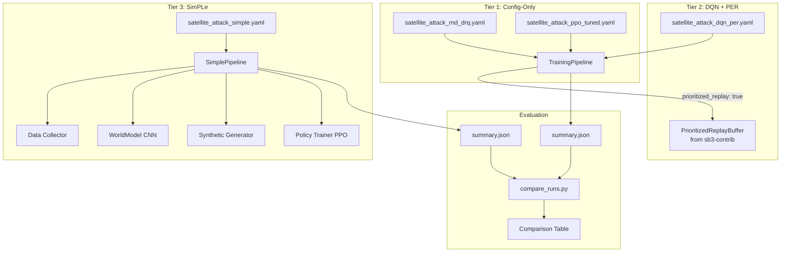
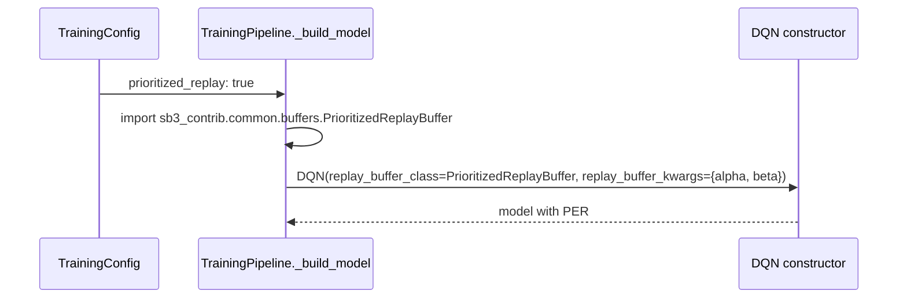
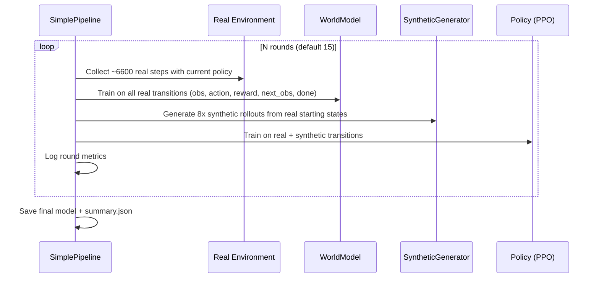

# Design Document: Satellite Attack Agent Improvement

## Overview

This design addresses the graduated improvement strategy for training a Satellite Attack agent to achieve non-zero scores within a 100k timestep budget. The current agent failed because it used survival reward (wrong signal) and couldn't complete episodes. The solution is organized in three tiers:

1. **Tier 1 (Config-only)**: Correct the reward signal to pure score delta, enable exploration aids (RND, DrQ, sticky actions), use joystick action mode, and tune PPO hyperparameters. No code changes required.
2. **Tier 2 (DQN + PER)**: Switch to an off-policy DQN algorithm with Prioritized Experience Replay via sb3-contrib, requiring a small pipeline extension to wire in the custom replay buffer.
3. **Tier 3 (SimPLe)**: Build a world model that generates synthetic experience, amplifying the 100k real steps into much more training data. This is a new module.

A comparison script ties everything together by loading `summary.json` files from multiple runs and ranking them.

The key insight: Satellite Attack gives +10 per hit with episodes ending on death (score drop). The reward is sparse — the agent must fire at the right time while moving. Pure score delta reward with strong exploration is the correct starting point.

## Architecture



### Tier 1 Flow (No Code Changes)

The existing `TrainingPipeline` already supports every feature needed:
- `reward_mode: memory` with `satellite_attack_memory` game profile → score delta from RAM
- `intrinsic_reward.enabled: true` → RND wrapper injected automatically
- `augmentation: true` → DrQ random crop + jitter in `PreprocessingPipeline`
- `sticky_actions: 0.25` → `StickyActionsWrapper` applied in pipeline
- `action_mode: joystick` → simultaneous move + fire via multi-discrete [3,3,2]
- PPO hyperparameters passed through `algorithm.extra`

Two YAML configs are the deliverables: a baseline with exploration aids, and a tuned PPO variant.

### Tier 2 Flow (Small Pipeline Extension)

DQN is already in `ALGORITHM_MAP`. The extension is wiring `PrioritizedReplayBuffer` from `sb3_contrib`:



The pipeline checks `config.prioritized_replay`, imports `sb3_contrib`, and passes the buffer class + kwargs to DQN. If `sb3_contrib` is missing, a clear `ImportError` is raised.

### Tier 3 Flow (New Module)

SimPLe alternates between real data collection, world model training, and policy training on synthetic data:



## Components and Interfaces

### Tier 1: Training Config YAML Files

Two new YAML files in `game_profiles/`:

**`satellite_attack_rnd_drq.yaml`** — Baseline with correct reward + exploration:
```yaml
algorithm:
  name: PPO
  learning_rate: 0.0003
  batch_size: 64
total_timesteps: 100000
game_profile: satellite_attack_memory
reward_mode: memory
survival_bonus: 0
reward_clip: 0
action_mode: joystick
policy: CnnPolicy
num_envs: 4
intrinsic_reward:
  enabled: true
  coefficient: 1.0
augmentation: true
sticky_actions: 0.25
grayscale: true
resize: [84, 84]
frame_stack: 4
frame_skip: 4
output_dir: output/satellite_attack_rnd_drq
```

**`satellite_attack_ppo_tuned.yaml`** — Tuned PPO on top of the baseline:
```yaml
algorithm:
  name: PPO
  learning_rate: 0.001
  batch_size: 64
  extra:
    ent_coef: 0.05
    n_steps: 512
    n_epochs: 4
    clip_range: 0.2
total_timesteps: 100000
game_profile: satellite_attack_memory
reward_mode: memory
survival_bonus: 0
reward_clip: 0
action_mode: joystick
policy: CnnPolicy
num_envs: 4
intrinsic_reward:
  enabled: true
  coefficient: 1.0
augmentation: true
sticky_actions: 0.25
grayscale: true
resize: [84, 84]
frame_stack: 4
frame_skip: 4
output_dir: output/satellite_attack_ppo_tuned
```

### Tier 2: PER Integration in Pipeline

**New config fields** in `TrainingConfig`:
```python
prioritized_replay: bool = False       # enable PER for DQN
prioritized_replay_alpha: float = 0.6  # prioritization exponent
prioritized_replay_beta: float = 0.4   # importance-sampling correction
```

**Pipeline change** in `_build_model()`:
```python
if self.config.prioritized_replay and self.config.algorithm.name in ("DQN",):
    try:
        from sb3_contrib.common.buffers import PrioritizedReplayBuffer
    except ImportError:
        raise ImportError(
            "sb3-contrib is required for prioritized replay. "
            "Install with: pip install sb3-contrib"
        )
    kwargs["replay_buffer_class"] = PrioritizedReplayBuffer
    kwargs["replay_buffer_kwargs"] = {
        "alpha": self.config.prioritized_replay_alpha,
        "beta": self.config.prioritized_replay_beta,
    }
```

**`satellite_attack_dqn_per.yaml`**:
```yaml
algorithm:
  name: DQN
  learning_rate: 0.0001
  batch_size: 32
  extra:
    buffer_size: 50000
    learning_starts: 1000
    exploration_fraction: 0.3
    exploration_final_eps: 0.05
    target_update_interval: 500
    train_freq: 4
total_timesteps: 100000
game_profile: satellite_attack_memory
reward_mode: memory
survival_bonus: 0
reward_clip: 0
action_mode: joystick
policy: CnnPolicy
num_envs: 1  # DQN is single-env
intrinsic_reward:
  enabled: true
  coefficient: 1.0
augmentation: true
sticky_actions: 0.25
prioritized_replay: true
prioritized_replay_alpha: 0.6
prioritized_replay_beta: 0.4
output_dir: output/satellite_attack_dqn_per
```

Note: DQN in SB3 does not support vectorized environments, so `num_envs: 1`.

### Tier 3: SimPLe Module

New module at `python/retro_ai/training/simple.py` with these classes:

#### WorldModel

```python
class WorldModel(nn.Module):
    """CNN that predicts next observation and reward from (obs, action)."""

    def __init__(self, obs_shape: Tuple[int, int, int], num_actions: int):
        # obs_shape: (C, H, W) e.g. (4, 84, 84) for 4-frame grayscale stack
        # Encoder: 3-layer CNN
        # Action embedding: nn.Embedding(num_actions, 64)
        # Decoder: transposed CNN → predicted next obs (C, H, W)
        # Reward head: FC → scalar reward prediction

    def forward(self, obs, action) -> Tuple[Tensor, Tensor]:
        """Returns (predicted_next_obs, predicted_reward)."""
```

Architecture details:
- Encoder: Conv2d(C, 64, 4, stride=2) → Conv2d(64, 128, 4, stride=2) → Conv2d(128, 256, 4, stride=2) → flatten → FC(256*latent, 512)
- Action embedding concatenated with latent: FC(512 + 64, 512)
- Observation decoder: FC(512, 256*latent) → reshape → ConvTranspose2d(256, 128, 4, stride=2) → ConvTranspose2d(128, 64, 4, stride=2) → ConvTranspose2d(64, C, 4, stride=2)
- Reward head: FC(512, 128) → ReLU → FC(128, 1)
- Loss: MSE for both observation and reward prediction

#### TransitionBuffer

```python
class TransitionBuffer:
    """Stores real environment transitions for world model training."""

    def __init__(self, capacity: int):
        self.observations: np.ndarray   # (N, H, W, C)
        self.actions: np.ndarray        # (N,)
        self.rewards: np.ndarray        # (N,)
        self.next_observations: np.ndarray  # (N, H, W, C)
        self.dones: np.ndarray          # (N,)

    def add(self, obs, action, reward, next_obs, done): ...
    def sample(self, batch_size) -> Tuple: ...
    def sample_starts(self, n) -> np.ndarray: ...
```

#### SyntheticGenerator

```python
class SyntheticGenerator:
    """Generates synthetic rollouts using the world model."""

    def __init__(self, world_model: WorldModel, horizon: int = 50):
        ...

    def generate(self, start_obs: np.ndarray, policy, num_steps: int) -> List[Transition]:
        """Unroll world model from start_obs using policy for num_steps."""
```

#### SimplePipeline

```python
class SimplePipeline:
    """Orchestrates the SimPLe training loop."""

    def __init__(self, config: TrainingConfig):
        ...

    def run(self) -> Path:
        """Execute iterative SimPLe training. Returns path to saved model."""
        # 1. Build environment
        # 2. Initialize world model, transition buffer, policy
        # 3. For each round:
        #    a. Collect real data with current policy
        #    b. Train world model on all real data
        #    c. Generate synthetic rollouts (8x amplification)
        #    d. Train policy (PPO) on real + synthetic
        #    e. Log round metrics
        # 4. Save final model + summary.json
```

**SimPLe config section** (nested in TrainingConfig):
```python
@dataclass
class SimpleConfig:
    enabled: bool = False
    num_rounds: int = 15
    world_model_epochs: int = 50
    world_model_lr: float = 1e-3
    world_model_batch_size: int = 64
    synthetic_ratio: int = 8        # synthetic steps per real step
    rollout_horizon: int = 50       # max synthetic rollout length
    quality_threshold: float = 0.1  # MSE warning threshold
```

### Tier 4: Comparison Script

New file at `python/retro_ai/training/compare.py`:

```python
class RunComparator:
    """Load and compare summary.json files from multiple training runs."""

    def __init__(self, output_dirs: List[str]):
        self.output_dirs = output_dirs

    def load_summaries(self) -> List[Dict]:
        """Load summary.json from each output directory."""

    def compare(self) -> str:
        """Return a formatted comparison table ranked by mean_reward."""

    def flag_nonfunctional(self, summary: Dict) -> bool:
        """Return True if total_episodes == 0."""
```

CLI integration via `retro-ai compare`:
```
retro-ai compare output/satellite_attack_rnd_drq output/satellite_attack_ppo_tuned output/satellite_attack_dqn_per
```

Output:
```
Rank | Config                    | Episodes | Mean Reward | Best Reward | Wall Clock
-----+---------------------------+----------+-------------+-------------+-----------
  1  | satellite_attack_ppo_tuned|       42 |        18.5 |          70 |     312.4s
  2  | satellite_attack_dqn_per  |       38 |        12.3 |          50 |     287.1s
  3  | satellite_attack_rnd_drq  |       35 |         8.7 |          40 |     298.6s
```

## Data Models

### TrainingConfig Extensions

```python
@dataclass
class TrainingConfig:
    # ... existing fields ...

    # Tier 2: PER support
    prioritized_replay: bool = False
    prioritized_replay_alpha: float = 0.6
    prioritized_replay_beta: float = 0.4

    # Tier 3: SimPLe support
    simple: SimpleConfig = field(default_factory=SimpleConfig)
```

### SimpleConfig

```python
@dataclass
class SimpleConfig:
    enabled: bool = False
    num_rounds: int = 15
    world_model_epochs: int = 50
    world_model_lr: float = 1e-3
    world_model_batch_size: int = 64
    synthetic_ratio: int = 8
    rollout_horizon: int = 50
    quality_threshold: float = 0.1
```

### Transition (for SimPLe buffer)

```python
@dataclass
class Transition:
    observation: np.ndarray      # (H, W, C) uint8
    action: int
    reward: float
    next_observation: np.ndarray # (H, W, C) uint8
    done: bool
```

### summary.json Schema (existing, unchanged)

```json
{
  "total_episodes": 42,
  "total_timesteps": 100000,
  "mean_reward": 18.5,
  "std_reward": 12.3,
  "best_reward": 70.0,
  "mean_length": 2380.0,
  "wall_clock_seconds": 312.4
}
```

### metrics.csv Schema (existing, unchanged)

| Column    | Type  | Description                    |
|-----------|-------|--------------------------------|
| episode   | int   | Sequential episode number      |
| reward    | float | Total episode reward           |
| length    | int   | Episode length in steps        |
| score     | float | Raw game score from RAM        |
| timestamp | float | Unix timestamp of episode end  |

### Comparison Output Schema

```json
{
  "runs": [
    {
      "output_dir": "output/satellite_attack_ppo_tuned",
      "config_name": "satellite_attack_ppo_tuned",
      "total_episodes": 42,
      "mean_reward": 18.5,
      "best_reward": 70.0,
      "mean_length": 2380.0,
      "wall_clock_seconds": 312.4,
      "functional": true
    }
  ],
  "ranked_by": "mean_reward"
}
```

## Correctness Properties

*A property is a characteristic or behavior that should hold true across all valid executions of a system — essentially, a formal statement about what the system should do. Properties serve as the bridge between human-readable specifications and machine-verifiable correctness guarantees.*

### Property 1: Tier 1 Baseline Config Correctness

*For any* training config parsed from the Tier 1 baseline YAML, the config SHALL have `reward_mode == "memory"`, `game_profile == "satellite_attack_memory"`, `survival_bonus == 0`, `action_mode == "joystick"`, `reward_clip == 0`, `intrinsic_reward.enabled == True`, `intrinsic_reward.coefficient == 1.0`, `augmentation == True`, `sticky_actions == 0.25`, `num_envs == 4`, and `total_timesteps == 100000`.

**Validates: Requirements 1.1, 1.2, 1.3, 1.4, 1.5, 1.6, 1.7, 1.8, 1.9**

### Property 2: Tuned PPO Config Correctness

*For any* training config parsed from the tuned PPO YAML, the config SHALL have `algorithm.extra["ent_coef"] == 0.05`, `algorithm.extra["n_steps"] == 512`, `algorithm.learning_rate == 0.001`, `algorithm.extra["n_epochs"] == 4`, and `algorithm.extra["clip_range"] == 0.2`.

**Validates: Requirements 2.1, 2.2, 2.3, 2.4, 2.5**

### Property 3: Config Inheritance Across Tiers

*For any* Tier 2+ training config (tuned PPO, DQN, DQN+PER), the shared fields `reward_mode`, `survival_bonus`, `action_mode`, and `reward_clip` SHALL match the Tier 1 baseline values (`"memory"`, `0`, `"joystick"`, `0` respectively).

**Validates: Requirements 2.6, 3.9**

### Property 4: DQN Config Correctness

*For any* training config parsed from the DQN YAML, the config SHALL have `algorithm.name == "DQN"`, `algorithm.extra["buffer_size"] == 50000`, `algorithm.extra["learning_starts"] == 1000`, `algorithm.extra["exploration_fraction"] == 0.3`, `algorithm.extra["exploration_final_eps"] == 0.05`, `algorithm.extra["target_update_interval"] == 500`, `algorithm.extra["train_freq"] == 4`, and `intrinsic_reward.enabled == True`.

**Validates: Requirements 3.1, 3.2, 3.3, 3.4, 3.5, 3.6, 3.7, 3.10**

### Property 5: PER Integration Correctness

*For any* TrainingConfig with `prioritized_replay == True` and `algorithm.name == "DQN"`, the pipeline's `_build_model` SHALL construct the DQN with `replay_buffer_class` set to `PrioritizedReplayBuffer` and `replay_buffer_kwargs` containing `alpha == config.prioritized_replay_alpha` and `beta == config.prioritized_replay_beta`.

**Validates: Requirements 4.1, 4.2, 4.3, 4.4, 4.6**

### Property 6: Transition Buffer Round-Trip

*For any* transition (observation, action, reward, next_observation, done) added to the TransitionBuffer, sampling from the buffer SHALL return transitions containing all five fields with values matching what was stored.

**Validates: Requirements 5.1**

### Property 7: World Model Output Shape Correctness

*For any* valid observation tensor of shape (batch, C, 84, 84) and action tensor of shape (batch,), the WorldModel forward pass SHALL return a predicted next observation of shape (batch, C, 84, 84) and a predicted reward of shape (batch, 1).

**Validates: Requirements 5.2, 5.4**

### Property 8: World Model Validation Error

*For any* set of held-out transitions, the validation function SHALL return a non-negative numeric MSE value comparing predicted observations against actual next observations.

**Validates: Requirements 5.6**

### Property 9: Synthetic Rollout Generation Constraints

*For any* synthetic generation run with a given real buffer, synthetic_ratio, and rollout_horizon: (a) the first observation of each rollout SHALL exist in the real buffer, (b) each individual rollout length SHALL be ≤ rollout_horizon, and (c) the total synthetic steps generated SHALL be approximately synthetic_ratio × real_buffer_size.

**Validates: Requirements 6.1, 6.2, 6.3, 6.4**

### Property 10: Synthetic Transition Format Consistency

*For any* synthetic transition produced by the SyntheticGenerator, it SHALL have the same fields (observation, action, reward, next_observation, done) and compatible dtypes as real transitions stored in the TransitionBuffer.

**Validates: Requirements 6.5**

### Property 11: SimPLe Budget Allocation Per Round

*For any* SimplePipeline configuration with total_timesteps T and num_rounds N, each round SHALL collect approximately T/N real environment steps (within ±10% tolerance for the last round).

**Validates: Requirements 7.2**

### Property 12: SimpleConfig YAML Round-Trip

*For any* valid SimpleConfig, serializing a TrainingConfig containing it to YAML and deserializing back SHALL produce an equivalent SimpleConfig with all fields preserved.

**Validates: Requirements 7.6**

### Property 13: Metrics Output Completeness

*For any* set of recorded episodes in MetricsTracker, calling write_summary() SHALL produce a summary.json containing keys "total_episodes", "mean_reward", "best_reward", "mean_length", and "wall_clock_seconds", and calling flush_csv() SHALL produce a metrics.csv with one row per episode containing columns "episode", "reward", "length", "score", and "timestamp".

**Validates: Requirements 8.1, 8.2**

### Property 14: Comparison Ranking Correctness

*For any* set of summary.json files with distinct mean_reward values, the RunComparator SHALL rank them in descending order of mean_reward and include total_episodes in each entry of the output.

**Validates: Requirements 8.3, 8.4, 8.5**

### Property 15: Non-Functional Run Flagging

*For any* summary with `total_episodes == 0`, the RunComparator SHALL flag the run as non-functional (`functional == False`). For any summary with `total_episodes > 0`, the run SHALL be flagged as functional (`functional == True`).

**Validates: Requirements 8.6**

## Error Handling

### Tier 1 (Config-Only)

- **Missing game profile**: If `satellite_attack_memory` profile is not found in `game_profiles/`, `GameProfileRegistry.load()` raises `ConfigurationError` with the profile name and search directories.
- **Missing ROM/BIOS**: If `$RETRO_AI_ROM_DIR` is not set or files don't exist, `BaseEnv` constructor raises an error at environment creation time. The pipeline logs the error before failing.
- **Invalid config fields**: `TrainingConfigParser.validate()` catches invalid `action_mode`, `observation_mode`, negative `total_timesteps`, etc.

### Tier 2 (DQN + PER)

- **Missing sb3-contrib**: When `prioritized_replay: true` but `sb3_contrib` is not installed, the pipeline raises `ImportError` with message: `"sb3-contrib is required for prioritized replay. Install with: pip install sb3-contrib"`.
- **PER with non-DQN**: If `prioritized_replay: true` is set with PPO, the pipeline ignores it (PER only applies to off-policy algorithms with replay buffers). A warning is logged.
- **DQN with num_envs > 1**: SB3's DQN does not support vectorized environments. The pipeline should warn and fall back to `num_envs: 1` if DQN is selected with `num_envs > 1`.

### Tier 3 (SimPLe)

- **World model divergence**: If the world model's validation MSE exceeds `quality_threshold`, a warning is logged but training continues. The threshold is configurable.
- **Empty transition buffer**: If the buffer has fewer transitions than `world_model_batch_size`, the world model training step is skipped with a warning.
- **Synthetic rollout early termination**: If the world model predicts `done=True`, the synthetic rollout terminates early. This is expected behavior, not an error.
- **GPU OOM during world model training**: The world model uses a modest architecture (3-layer CNN). If OOM occurs, the error propagates with a suggestion to reduce `world_model_batch_size`.

### Comparison Script

- **Missing summary.json**: If an output directory doesn't contain `summary.json`, the comparator skips it with a warning listing the missing directory.
- **Malformed JSON**: If `summary.json` is not valid JSON, the comparator skips it with a warning.
- **No valid runs**: If all directories are skipped, the comparator prints "No valid training runs found" and exits with code 1.

## Testing Strategy

### Dual Testing Approach

This feature uses both unit tests and property-based tests for comprehensive coverage:

- **Unit tests**: Verify specific examples, edge cases, and integration points (e.g., config file parsing of specific YAML files, DQN in ALGORITHM_MAP, sb3-contrib import error handling)
- **Property tests**: Verify universal properties across generated inputs (e.g., config field correctness, transition buffer round-trips, comparison ranking)

### Property-Based Testing Configuration

- **Library**: [Hypothesis](https://hypothesis.readthedocs.io/) for Python
- **Minimum iterations**: 100 per property test
- **Tag format**: `# Feature: satellite-attack-agent-improvement, Property {N}: {title}`
- Each correctness property maps to exactly one property-based test

### Property Test Plan

| Property | Test Description | Generator Strategy |
|----------|-----------------|-------------------|
| P1: Tier 1 Baseline Config | Parse YAML, assert all field values | Fixed YAML content (example-based, config is static) |
| P2: Tuned PPO Config | Parse YAML, assert PPO hyperparameters | Fixed YAML content |
| P3: Config Inheritance | For generated config overrides, shared fields match Req 1 | Generate random non-shared field values, verify shared fields unchanged |
| P4: DQN Config | Parse YAML, assert DQN hyperparameters | Fixed YAML content |
| P5: PER Integration | Build model kwargs with PER enabled, verify buffer class + params | Generate random alpha ∈ (0,1), beta ∈ (0,1), verify kwargs |
| P6: Transition Buffer Round-Trip | Add random transitions, sample, verify fields match | Generate random obs (uint8 arrays), actions (ints), rewards (floats), dones (bools) |
| P7: World Model Output Shape | Forward pass with random input, verify output shapes | Generate random batch sizes, verify (batch, C, 84, 84) and (batch, 1) |
| P8: World Model Validation | Compute validation error on random transitions | Generate random predicted/actual obs pairs, verify MSE ≥ 0 |
| P9: Synthetic Rollout Constraints | Generate rollouts, verify length ≤ horizon and count ≈ ratio × buffer | Generate random buffer sizes, ratios, horizons |
| P10: Synthetic Transition Format | Compare synthetic vs real transition fields and dtypes | Generate random synthetic rollouts, verify field presence and dtype compatibility |
| P11: SimPLe Budget Allocation | Compute steps per round, verify ≈ T/N | Generate random T and N, verify allocation |
| P12: SimpleConfig Round-Trip | Serialize/deserialize SimpleConfig via YAML | Generate random SimpleConfig field values |
| P13: Metrics Output Completeness | Record random episodes, verify summary.json keys and CSV rows | Generate random episode rewards/lengths |
| P14: Comparison Ranking | Create summaries with random mean_rewards, verify sort order | Generate random mean_reward values, verify descending order |
| P15: Non-Functional Flagging | Create summaries with random episode counts, verify flagging | Generate total_episodes ∈ {0, 1, ..., N}, verify functional == (episodes > 0) |

### Unit Test Plan

| Test | Description | Type |
|------|-------------|------|
| DQN in ALGORITHM_MAP | Verify "DQN" key exists in pipeline.ALGORITHM_MAP | Example |
| sb3-contrib import error | Mock missing sb3_contrib, verify ImportError message | Edge case |
| DQN num_envs warning | Set DQN with num_envs > 1, verify warning/fallback | Edge case |
| PER with PPO ignored | Set prioritized_replay with PPO, verify it's ignored | Edge case |
| World model accepts 84x84 input | Forward pass with (1, 4, 84, 84) tensor | Example |
| Pipeline produces model file | Run pipeline with minimal config, verify .zip exists | Integration |
| Comparison with missing summary | Point to empty dir, verify skip + warning | Edge case |
| Empty transition buffer skip | Train world model with empty buffer, verify skip | Edge case |
