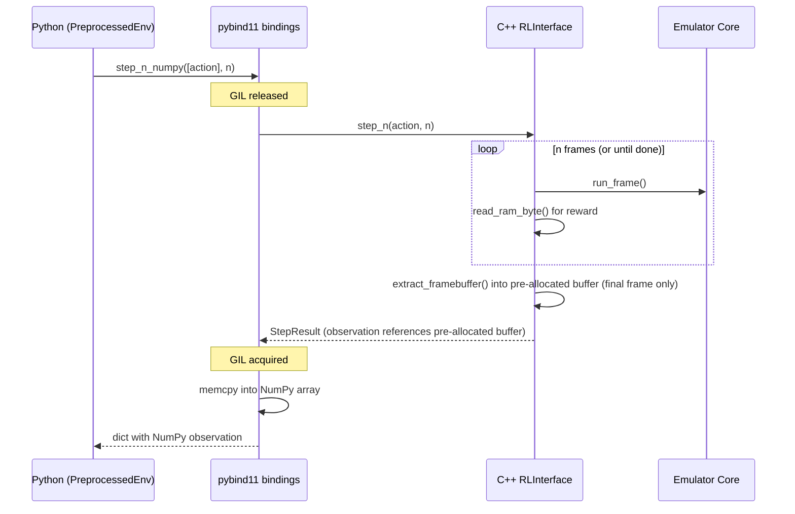

# Design Document: Training Performance

## Overview

This design addresses the 6× throughput gap between the raw C++ emulator (206 fps) and end-to-end training (35 fps). The 70% overhead lives in the Python/SB3 layer: per-frame Python↔C++ round-trips, GIL contention, observation copies, and single-process data collection. The C++ side has its own hotspots — per-frame `std::vector` allocations in `extract_framebuffer()` and `read_ram()`, and the VDC simulation dominating `run_frame()`.

The optimization strategy has three tiers:

1. **Reduce Python↔C++ round-trips**: `step_n()` batching, frame skip in C++, vectorized environments via `SubprocVecEnv`
2. **Eliminate hot-path allocations**: pre-allocated framebuffer, single-byte RAM reads, zero-copy observation return
3. **Reduce per-frame work**: RAM-based observations (skip VDC entirely), configurable resolution, mixed precision training, PGO builds

All changes are designed to be emulator-agnostic — the `RLInterface` base class gets the new methods, and each emulator adapter implements them.

## Architecture

```mermaid
graph TD
    subgraph "Training Pipeline (Python)"
        TP[TrainingPipeline] --> VE{num_envs > 1?}
        VE -->|Yes| SPV[SubprocVecEnv]
        VE -->|No| SE[Single Env]
        SPV --> W1[Worker 1: BaseEnv → PreprocessedEnv → GymnasiumWrapper]
        SPV --> W2[Worker 2: BaseEnv → PreprocessedEnv → GymnasiumWrapper]
        SPV --> WN[Worker N: ...]
        SE --> GW[BaseEnv → PreprocessedEnv → GymnasiumWrapper]
    end

    subgraph "C++ RLInterface"
        SI[step_n&#40;action, n&#41;] --> RF[run_frame × n]
        RF --> EF{observation_mode}
        EF -->|framebuffer| FB[Pre-allocated RGB buffer]
        EF -->|ram| RB[RAM byte array]
        SI --> RW[read_ram_byte&#40;addr&#41; for rewards]
    end

    subgraph "SB3 Model"
        MP{mixed_precision?}
        MP -->|Yes| AMP[torch.cuda.amp.autocast]
        MP -->|No| FP32[Standard FP32]
    end

    W1 --> SI
    GW --> SI
```



### Data Flow (Optimized Hot Path)



## Components and Interfaces

### 1. RLInterface Base Class Changes

```cpp
// New methods added to RLInterface (include/retro_ai/rl_interface.hpp)

class RLInterface {
public:
    // ... existing methods ...

    // Step N frames with the same action, return final observation + accumulated reward.
    // Default implementation calls step() N times.
    virtual StepResult step_n(const std::vector<int>& action, int n) {
        StepResult result;
        float total_reward = 0.0f;
        for (int i = 0; i < n; ++i) {
            result = step(action);
            total_reward += result.reward;
            if (result.done || result.truncated) break;
        }
        result.reward = total_reward;
        return result;
    }

    // Read a single byte from emulator RAM without allocation.
    // Returns 0 for out-of-range addresses. Default returns 0.
    virtual uint8_t read_ram_byte(uint16_t address) const { return 0; }

    // Return RAM size for RAM-based observation space.
    virtual int ram_size() const { return 0; }

    // Return RAM contents as observation (flat byte vector).
    virtual std::vector<uint8_t> read_ram_observation() const { return read_ram(); }
};
```

### 2. VideopacRLInterface Changes

```cpp
class VideopacRLInterface::Impl {
    // Pre-allocated framebuffer (Requirement 4)
    std::vector<uint8_t> rgb_buffer_;  // allocated once in constructor

    // Constructor: rgb_buffer_(kFramebufferSize) in initializer list

    // Optimized extract_framebuffer writes into rgb_buffer_ in-place
    const std::vector<uint8_t>& extract_framebuffer() {
        const uint8_t* indexed_fb = emulator_->get_framebuffer();
        for (int i = 0; i < kScreenWidth * kScreenHeight; ++i) {
            uint8_t idx = indexed_fb[i] & 0x0F;
            const auto& c = PALETTE_STANDARD[idx];
            rgb_buffer_[i * 3 + 0] = c.r;
            rgb_buffer_[i * 3 + 1] = c.g;
            rgb_buffer_[i * 3 + 2] = c.b;
        }
        return rgb_buffer_;
    }

    // Single-byte RAM read (Requirement 5)
    uint8_t read_ram_byte(uint16_t address) const {
        if (address < 64) {
            return emulator_->get_cpu_state().ram[address];
        }
        if (address < 192) {
            return emulator_->get_memory_state().external_ram[address - 64];
        }
        return 0;
    }

    // Optimized step_n: skip intermediate framebuffer extraction (Requirement 11)
    StepResult step_n(const std::vector<int>& action, int n) {
        // validate action...
        float total_reward = 0.0f;
        bool done = false;
        for (int i = 0; i < n; ++i) {
            apply_action(action[0]);
            emulator_->run_frame();
            clear_input();
            ++frame_number_;
            // Compute reward without framebuffer extraction
            if (reward_system_) {
                // reward system uses read_ram_byte, not extract_framebuffer
                total_reward += compute_frame_reward();
            }
            done = is_timer_expired();
            if (done) break;
        }
        // Extract framebuffer only for the final frame
        StepResult result;
        result.observation = extract_framebuffer_copy();  // or reference
        result.reward = total_reward;
        result.done = done;
        result.truncated = false;
        result.info = "{\"frame_number\": " + std::to_string(frame_number_) + "}";
        return result;
    }
};
```

### 3. MemoryRewardSystem Wire-up Fix

The current `wire_memory_reward_system()` captures a lambda that calls `read_ram()` (allocates 192-byte vector) every frame. The fix:

```cpp
// Before (allocates every call):
mem_reward->set_memory_reader([this](uint16_t addr) -> uint8_t {
    auto ram = read_ram();  // allocates std::vector<uint8_t>(192)
    if (addr < ram.size()) return ram[addr];
    return 0;
});

// After (zero allocation):
mem_reward->set_memory_reader([this](uint16_t addr) -> uint8_t {
    return read_ram_byte(addr);
});
```

### 4. pybind11 Bindings Extensions

```cpp
// New bindings for step_n and read_ram_byte
.def("step_n", [](RLInterface& self, const std::vector<int>& action, int n) {
    StepResult result;
    {
        py::gil_scoped_release release;
        result = self.step_n(action, n);
    }
    return result;
}, py::arg("action"), py::arg("n"))

.def("step_n_numpy", [](RLInterface& self, const std::vector<int>& action, int n) {
    StepResult result;
    {
        py::gil_scoped_release release;
        result = self.step_n(action, n);
    }
    return step_result_to_dict(result, self.observation_space());
}, py::arg("action"), py::arg("n"))

.def("read_ram_byte", &RLInterface::read_ram_byte, py::arg("address"))
.def("ram_size", &RLInterface::ram_size)
```

### 5. TrainingPipeline Vectorized Environment Support

```python
# pipeline.py changes
from stable_baselines3.common.vec_env import SubprocVecEnv, DummyVecEnv

def _build_env(self):
    num_envs = self.config.num_envs  # new config field, default 1

    def make_env(rank):
        def _init():
            base = BaseEnv(...)
            pipeline = PreprocessingPipeline(...)
            preprocessed = PreprocessedEnv(base, pipeline)
            env = GymnasiumWrapper(preprocessed)
            if self._game_profile and self._game_profile.startup_sequence:
                env = StartupSequenceWrapper(env, self._game_profile.startup_sequence)
            return env
        return _init

    if num_envs == 1:
        return make_env(0)()  # no subprocess overhead
    else:
        return SubprocVecEnv([make_env(i) for i in range(num_envs)])
```

### 6. BaseEnv Observation Mode Support

```python
class BaseEnv:
    def __init__(self, ..., observation_mode: str = "framebuffer"):
        self._observation_mode = observation_mode
        # ...

    def step(self, action):
        if self._observation_mode == "ram":
            result = self._interface.step_numpy([action])
            # Replace observation with RAM bytes
            ram_bytes = self._interface.read_ram()
            observation = np.frombuffer(ram_bytes, dtype=np.uint8)
        else:
            result = self._interface.step_numpy([action])
            observation = result["observation"]
        # ...
```

### 7. PreprocessedEnv with step_n Integration

When `frame_skip > 1` and the underlying interface supports `step_n`, `PreprocessedEnv` delegates to `step_n` instead of calling `step()` in a Python loop:

```python
class PreprocessedEnv:
    def step(self, action):
        if self.preprocessing.frame_skip > 1 and hasattr(self.env, '_interface'):
            # Use C++ step_n to avoid N Python→C++ round-trips
            result = self.env.step_n(action, self.preprocessing.frame_skip)
            obs, reward, done, truncated, info = result
            processed_obs = self.preprocessing.process(obs)
            return processed_obs, reward, done, truncated, info
        else:
            # Fallback: Python-side frame skip loop (existing behavior)
            ...
```

### 8. CMake PGO Support

```cmake
# New options in CMakeLists.txt
option(PGO_GENERATE "Build with PGO instrumentation" OFF)
option(PGO_USE "Build using PGO profile data" OFF)

if(PGO_GENERATE)
    if(CMAKE_CXX_COMPILER_ID MATCHES "GNU")
        add_compile_options(-fprofile-generate=${CMAKE_BINARY_DIR}/pgo-data)
        add_link_options(-fprofile-generate=${CMAKE_BINARY_DIR}/pgo-data)
    elseif(CMAKE_CXX_COMPILER_ID MATCHES "Clang")
        add_compile_options(-fprofile-instr-generate=${CMAKE_BINARY_DIR}/pgo-data/default.profraw)
        add_link_options(-fprofile-instr-generate=${CMAKE_BINARY_DIR}/pgo-data/default.profraw)
    endif()
elseif(PGO_USE)
    if(CMAKE_CXX_COMPILER_ID MATCHES "GNU")
        add_compile_options(-fprofile-use=${CMAKE_BINARY_DIR}/pgo-data -fprofile-correction)
        add_link_options(-fprofile-use=${CMAKE_BINARY_DIR}/pgo-data)
    elseif(CMAKE_CXX_COMPILER_ID MATCHES "Clang")
        add_compile_options(-fprofile-instr-use=${CMAKE_BINARY_DIR}/pgo-data/default.profdata)
        add_link_options(-fprofile-instr-use=${CMAKE_BINARY_DIR}/pgo-data/default.profdata)
    endif()
endif()
```

### 9. Mixed Precision Training

```python
# pipeline.py: _build_model changes
def _build_model(self, env):
    algo_cls = ALGORITHM_MAP[self.config.algorithm.name]
    kwargs = { ... }

    if self.config.mixed_precision:
        import torch
        if torch.cuda.is_available():
            kwargs["policy_kwargs"] = kwargs.get("policy_kwargs", {})
            kwargs["policy_kwargs"]["optimizer_kwargs"] = {"fused": True}
            # SB3 doesn't natively support AMP, so we wrap via custom policy
            # or use torch.set_float32_matmul_precision('medium')
        else:
            self._logger.warning("mixed_precision enabled but no CUDA GPU available, using FP32")
```

### 10. Profiling Infrastructure

A C++ benchmark that instruments `run_frame()` components using `std::chrono`:

```cpp
// scripts/bench_components.cpp or exposed via pybind11
struct FrameTimings {
    double cpu_us;
    double vdc_us;
    double framebuffer_us;
    double reward_us;
    double total_us;
};
```

Exposed to Python so `scripts/bench_step.py` can report per-component breakdowns.

## Data Models

### TrainingConfig Extensions

```python
@dataclass
class TrainingConfig:
    # ... existing fields ...

    # New performance fields
    num_envs: int = 1                          # Requirement 2
    observation_mode: str = "framebuffer"       # Requirement 6: "framebuffer" | "ram"
    mixed_precision: bool = False               # Requirement 8
```

### Game Profile YAML Schema Extensions

```yaml
# New optional fields in game profile YAML
frame_skip: 4                    # Requirement 3: recommended frame skip (1-16)
frame_skip_rationale: "..."      # Requirement 3: why this value
observation_mode: framebuffer    # Requirement 6: "framebuffer" or "ram"
resize: [84, 84]                 # Requirement 7: recommended resolution
resize_rationale: "..."          # Requirement 7: why this resolution
```

### StepResult (unchanged structure, changed semantics)

The `StepResult.observation` field continues to be `std::vector<uint8_t>`. The pre-allocated buffer optimization is internal to the Impl class — `step()` copies from the pre-allocated buffer into the returned `StepResult.observation` to maintain the existing ownership semantics. The `step_n()` method does the same but only for the final frame.

For the RAM observation mode, `StepResult.observation` contains the flat RAM bytes instead of RGB pixels, and `ObservationSpace` is adjusted:

```cpp
ObservationSpace observation_space() const {
    if (observation_mode_ == "ram") {
        return {ram_size(), 1, 1, 8};  // 1D: (ram_size, 1, 1)
    }
    return {kScreenWidth, kScreenHeight, kScreenChannels, 8};
}
```

### Benchmark Output Schema

```json
{
    "timestamp": "2025-01-15T10:30:00Z",
    "game_profile": "course_automobile",
    "num_envs": 4,
    "frame_skip": 4,
    "observation_mode": "framebuffer",
    "resize": [84, 84],
    "total_timesteps": 10000,
    "wall_clock_seconds": 28.5,
    "fps": 350.9,
    "component_timings": {
        "emulator_step_ms": 4.8,
        "reward_ms": 0.01,
        "preprocessing_ms": 0.5,
        "model_inference_ms": 2.1
    }
}
```

### Baseline and Comparison Output Schemas

These additional data models support the profiling and benchmarking infrastructure (Requirements 14-16).

**Baseline JSON** (`benchmarks/baseline.json`): Extends the Benchmark Output Schema with an `environment` sub-object containing hardware/software metadata (see Section 13 below).

**Comparison Output JSON**: Each comparison result contains `optimization_name`, `baseline_fps`, `optimized_fps`, `absolute_delta`, `percentage_improvement`, and an optional `warning` field for regressions (see Section 14 below).

**References JSON** (`benchmarks/references.json`): Maps configuration names to `{fps, timestamp}` objects used by the regression detection script (see Section 15 below).

## Components and Interfaces (continued)

The following sections extend the component design to cover profiling tooling (Requirements 12-13) and benchmarking infrastructure (Requirements 14-16).

### 11. Python-Side Profiling with py-spy (Requirement 12)

A helper script `scripts/profile_pyspy.py` wraps py-spy invocation around a training session. It:

1. Accepts `--mode record|top`, `--output-dir`, `--game-profile`, `--timesteps`, and `--rate` (sampling Hz)
2. Constructs the appropriate py-spy command:
   - `record` mode: `py-spy record -o <output_dir>/flamegraph.svg --rate <rate> -- python -m retro_ai.training.cli train <profile>`
   - `top` mode: `py-spy top --rate <rate> -- python -m retro_ai.training.cli train <profile>`
3. Uses the sidecar monitor pattern (`scripts/monitor.py`) for the `record` mode to handle long-running sessions
4. Defaults: `--rate 100`, `--timesteps 5000`, `--output-dir output/profiling`

```python
# scripts/profile_pyspy.py — core command construction

def build_pyspy_command(
    mode: str,
    output_dir: str,
    game_profile: str,
    timesteps: int,
    rate: int,
) -> list[str]:
    """Build the py-spy command line for the given mode.

    Returns the command as a list of strings suitable for subprocess.
    """
    train_cmd = [
        sys.executable, "-m", "retro_ai.training.cli", "train",
        game_profile, "--total-timesteps", str(timesteps),
    ]

    if mode == "record":
        svg_path = os.path.join(output_dir, "flamegraph.svg")
        return ["py-spy", "record", "-o", svg_path, "--rate", str(rate), "--"] + train_cmd
    elif mode == "top":
        return ["py-spy", "top", "--rate", str(rate), "--"] + train_cmd
    else:
        raise ValueError(f"Unknown mode: {mode!r}. Use 'record' or 'top'.")
```

The script does not modify the training code — py-spy attaches externally as a sampling profiler. The `record` mode produces a flame graph SVG; the `top` mode provides a live interactive view.

### 12. C++ Profiling with gprof or perf (Requirement 13)

Two new CMake build options are added alongside the existing `PGO_GENERATE`/`PGO_USE`:

```cmake
option(PROFILING_GPROF "Build with gprof instrumentation (-pg)" OFF)
option(PROFILING_PERF "Build with perf-compatible symbols (-g -fno-omit-frame-pointer)" OFF)

# Mutual exclusivity check
set(_PROF_COUNT 0)
foreach(_opt PGO_GENERATE PGO_USE PROFILING_GPROF PROFILING_PERF)
    if(${_opt})
        math(EXPR _PROF_COUNT "${_PROF_COUNT} + 1")
    endif()
endforeach()
if(_PROF_COUNT GREATER 1)
    message(FATAL_ERROR
        "Only one of PGO_GENERATE, PGO_USE, PROFILING_GPROF, PROFILING_PERF "
        "may be enabled at a time.")
endif()

# gprof instrumentation
if(PROFILING_GPROF)
    add_compile_options(-pg)
    add_link_options(-pg)
endif()

# perf-compatible symbols
if(PROFILING_PERF)
    add_compile_options(-g -fno-omit-frame-pointer)
    add_link_options(-g)
endif()
```

A helper script `scripts/profile_cpp.py` automates the profiling workflow:

```python
# scripts/profile_cpp.py — orchestrates C++ profiling

def run_gprof_workflow(build_dir: str, game_profile: str, timesteps: int, output_dir: str):
    """Run gprof profiling: execute workload, then gprof analysis."""
    # 1. Run the PGO training workload (reuses existing script)
    workload_cmd = [sys.executable, "scripts/pgo_training_workload.py",
                    "--game-profile", game_profile, "--timesteps", str(timesteps)]
    subprocess.run(workload_cmd, check=True)
    # 2. Run gprof on the generated gmon.out
    gprof_cmd = ["gprof", os.path.join(build_dir, "retro_ai_native*.so"), "gmon.out"]
    # ... write flat profile + call graph to output_dir

def run_perf_workflow(game_profile: str, timesteps: int, output_dir: str):
    """Run perf profiling: perf record, then perf script → flame graph."""
    workload_cmd = [sys.executable, "scripts/pgo_training_workload.py",
                    "--game-profile", game_profile, "--timesteps", str(timesteps)]
    perf_cmd = ["perf", "record", "-g", "--"] + workload_cmd
    # ... then perf script | stackcollapse-perf.pl | flamegraph.pl
```

### 13. Baseline Performance Documentation (Requirement 14)

The baseline is captured by running `scripts/bench_training.py` with default parameters and storing the result at `benchmarks/baseline.json`. A helper script `scripts/capture_baseline.py` automates this:

```python
# scripts/capture_baseline.py

def capture_baseline(output_path: str = "benchmarks/baseline.json"):
    """Run bench_training.py with defaults and save baseline + environment info."""
    # Run benchmark
    result = run_bench_training(
        game_profile="course_automobile",
        num_envs=1, frame_skip=4,
        observation_mode="framebuffer",
        resize=(84, 84), timesteps=10000,
    )
    # Add environment metadata
    result["environment"] = collect_environment_info()
    # Write to file
    os.makedirs(os.path.dirname(output_path), exist_ok=True)
    with open(output_path, "w") as f:
        json.dump(result, f, indent=2)

def collect_environment_info() -> dict:
    """Collect hardware/software environment for reproducibility."""
    import platform, torch
    return {
        "cpu_model": platform.processor() or platform.machine(),
        "ram_gb": round(os.sysconf("SC_PAGE_SIZE") * os.sysconf("SC_PHYS_PAGES") / (1024**3), 1),
        "os": f"{platform.system()} {platform.release()}",
        "python_version": platform.python_version(),
        "pytorch_version": torch.__version__,
        "compiler": get_compiler_version(),
        "build_flags": "Release (no PGO, no profiling)",
    }
```

Baseline JSON schema:

```json
{
    "timestamp": "2025-01-15T10:30:00Z",
    "game_profile": "course_automobile",
    "num_envs": 1,
    "frame_skip": 4,
    "observation_mode": "framebuffer",
    "resize": [84, 84],
    "total_timesteps": 10000,
    "wall_clock_seconds": 285.7,
    "fps": 35.0,
    "component_timings": { ... },
    "environment": {
        "cpu_model": "Intel i7-12700K",
        "ram_gb": 32.0,
        "os": "Linux 6.1.0",
        "python_version": "3.11.5",
        "pytorch_version": "2.1.0",
        "compiler": "GCC 12.3.0",
        "build_flags": "Release (no PGO, no profiling)"
    }
}
```

### 14. Per-Optimization Impact Measurement (Requirement 15)

A comparison script `scripts/bench_compare.py` runs a benchmark with a specific optimization and compares against the stored baseline:

```python
# scripts/bench_compare.py

def compute_comparison(baseline_fps: float, optimized_fps: float, optimization_name: str) -> dict:
    """Compute the comparison metrics between baseline and optimized fps.

    Returns a dict with all required fields for the comparison output.
    """
    absolute_delta = optimized_fps - baseline_fps
    percentage_improvement = (absolute_delta / baseline_fps * 100.0) if baseline_fps > 0 else 0.0
    result = {
        "optimization_name": optimization_name,
        "baseline_fps": round(baseline_fps, 1),
        "optimized_fps": round(optimized_fps, 1),
        "absolute_delta": round(absolute_delta, 1),
        "percentage_improvement": round(percentage_improvement, 1),
    }
    if optimized_fps < baseline_fps:
        result["warning"] = "REGRESSION: optimized fps is lower than baseline"
    return result
```

Supported optimization levers (each run independently against baseline):

| Lever | bench_training.py args |
|---|---|
| `vecenv-2` | `--num-envs 2` |
| `vecenv-4` | `--num-envs 4` |
| `vecenv-8` | `--num-envs 8` |
| `frameskip-1` | `--frame-skip 1` |
| `frameskip-2` | `--frame-skip 2` |
| `frameskip-8` | `--frame-skip 8` |
| `ram-obs` | `--observation-mode ram` |
| `lowres-42` | `--resize 42 42` |
| `highres-160` | `--resize 160 240` |

### 15. Performance Regression Detection (Requirement 16)

A regression benchmark script `scripts/bench_regression.py` runs a fixed set of configurations and compares against stored reference values in `benchmarks/references.json`:

```python
# scripts/bench_regression.py

REGRESSION_CONFIGS = [
    {"name": "default", "args": {}},
    {"name": "vectorized-4", "args": {"num_envs": 4}},
    {"name": "ram-observation", "args": {"observation_mode": "ram"}},
]

def check_regression(measured_fps: float, reference_fps: float, tolerance: float = 0.10) -> bool:
    """Return True if measured_fps is within tolerance of reference_fps.

    A regression is detected when measured_fps < reference_fps * (1 - tolerance).
    """
    return measured_fps >= reference_fps * (1.0 - tolerance)

def run_regression_suite(
    references: dict,
    tolerance: float = 0.10,
    configs: list[dict] | None = None,
) -> tuple[list[dict], bool]:
    """Run all regression configs and return (results, all_passed).

    Each result dict contains: name, reference_fps, measured_fps, passed, delta_pct.
    all_passed is True only if every config passed.
    """
    if configs is None:
        configs = REGRESSION_CONFIGS
    results = []
    all_passed = True
    for config in configs:
        name = config["name"]
        ref_fps = references.get(name, {}).get("fps", 0.0)
        measured_fps = run_benchmark(config["args"])
        passed = check_regression(measured_fps, ref_fps, tolerance)
        if not passed:
            all_passed = False
        results.append({
            "name": name,
            "reference_fps": ref_fps,
            "measured_fps": round(measured_fps, 1),
            "passed": passed,
            "delta_pct": round((measured_fps - ref_fps) / ref_fps * 100, 1) if ref_fps > 0 else 0.0,
        })
    return results, all_passed
```

References JSON schema (`benchmarks/references.json`):

```json
{
    "default": {"fps": 35.0, "timestamp": "2025-01-15T10:30:00Z"},
    "vectorized-4": {"fps": 120.0, "timestamp": "2025-01-15T10:35:00Z"},
    "ram-observation": {"fps": 180.0, "timestamp": "2025-01-15T10:40:00Z"}
}
```

The script supports `--update-references` to overwrite references with current measurements, `--tolerance` to configure the regression threshold (default 10%), and exits with code 0 on all-pass, non-zero on any failure.

## Correctness Properties

*A property is a characteristic or behavior that should hold true across all valid executions of a system — essentially, a formal statement about what the system should do. Properties serve as the bridge between human-readable specifications and machine-verifiable correctness guarantees.*

### Property 1: Profiling output percentages sum correctly

*For any* set of per-component timing measurements (CPU, VDC, framebuffer, reward), the formatted profiling output shall contain percentage values that sum to 100% (within floating-point tolerance) and each absolute timing shall be non-negative.

**Validates: Requirements 1.3**

### Property 2: Vectorized environment construction matches num_envs

*For any* `num_envs` value greater than 1, the constructed environment shall be a `SubprocVecEnv` with exactly `num_envs` sub-environments. For `num_envs` equal to 1, the result shall be a single unwrapped environment (not a `SubprocVecEnv`).

**Validates: Requirements 2.1, 2.2, 2.3**

### Property 3: Batch size invariant under vectorization

*For any* `num_envs` and base `n_steps` configuration, the effective batch size (`num_envs × adjusted_n_steps`) shall equal the configured target batch size, ensuring training dynamics remain consistent regardless of parallelism.

**Validates: Requirements 2.4**

### Property 4: Frame skip range validation

*For any* integer value for `frame_skip`, values in [1, 16] shall be accepted by `PreprocessedEnv`, and values outside that range shall be rejected.

**Validates: Requirements 3.1**

### Property 5: Frame skip reward accumulation

*For any* action and frame skip value N, the reward returned by `PreprocessedEnv.step()` with `frame_skip=N` shall equal the sum of rewards from N individual `BaseEnv.step()` calls with the same action (when no early termination occurs). When the episode terminates at frame k < N, the accumulated reward shall equal the sum of rewards for frames 1 through k.

**Validates: Requirements 3.2, 3.3**

### Property 6: Framebuffer pixel equivalence after optimization

*For any* emulator state, the RGB framebuffer produced by the optimized `extract_framebuffer()` (writing into a pre-allocated buffer) shall be pixel-for-pixel identical to the output of the original implementation (allocating a new vector each call).

**Validates: Requirements 4.4**

### Property 7: read_ram_byte equivalence with read_ram

*For any* valid RAM address in [0, 191], `read_ram_byte(addr)` shall return the same value as `read_ram()[addr]`. For any address >= 192, `read_ram_byte(addr)` shall return 0.

**Validates: Requirements 5.1, 5.4**

### Property 8: RAM observation correctness

*For any* emulator state when `observation_mode` is `"ram"`, the observation returned by `step()` shall be a 1-D uint8 array of length equal to `ram_size()`, and each byte shall equal the corresponding byte from `read_ram()`.

**Validates: Requirements 6.2, 6.3**

### Property 9: Resize produces correct output dimensions

*For any* input framebuffer of dimensions (H, W, C) and any target resolution (h, w) where h > 0 and w > 0, the resized output shall have shape (h, w, C). Each output pixel at (r, c) shall equal the source pixel at (r × H // h, c × W // w) — nearest-neighbor correctness.

**Validates: Requirements 7.2**

### Property 10: Low resolution warning threshold

*For any* resize value where height < 42 or width < 42, the Training_Pipeline shall emit a warning log. For resize values where both dimensions are >= 42, no such warning shall be emitted.

**Validates: Requirements 7.4**

### Property 11: step_n reward equivalence with sequential steps

*For any* action and frame count N, calling `step_n(action, N)` from the same emulator state shall produce a reward equal to the sum of N sequential `step(action)` calls from that same state (when no early termination occurs). When early termination occurs at frame k < N, the result shall have `done=true` and reward equal to the sum of k steps.

**Validates: Requirements 11.1, 11.2**

### Property 12: step() is equivalent to step_n(action, 1)

*For any* action and emulator state, `step(action)` shall produce an identical `StepResult` (observation, reward, done, truncated) to `step_n(action, 1)`.

**Validates: Requirements 11.4**

### Property 13: Benchmark output is valid JSON

*For any* benchmark run with valid parameters, the output shall be parseable as valid JSON containing at minimum the keys: `fps`, `wall_clock_seconds`, `total_timesteps`.

**Validates: Requirements 10.4**

### Property 14: py-spy helper constructs correct command for mode

*For any* valid mode (`"record"` or `"top"`), game profile string, positive timestep count, and positive sampling rate, `build_pyspy_command()` shall return a command list where: (a) the first element is `"py-spy"`, (b) the second element equals the mode, (c) `"record"` mode includes `"-o"` followed by a path ending in `.svg`, and (d) the command ends with the training CLI invocation including the game profile and timestep count. For any invalid mode, the function shall raise `ValueError`.

**Validates: Requirements 12.5, 12.6**

### Property 15: Baseline JSON contains all required fields

*For any* valid baseline JSON object produced by `capture_baseline()`, it shall contain at minimum the keys: `fps`, `wall_clock_seconds`, `total_timesteps`, `game_profile`, `component_timings`, and `environment`. The `environment` sub-object shall contain at minimum: `cpu_model`, `ram_gb`, `os`, `python_version`, `pytorch_version`, `compiler`, `build_flags`.

**Validates: Requirements 14.2, 14.4**

### Property 16: Comparison delta computation correctness

*For any* positive `baseline_fps` and non-negative `optimized_fps`, `compute_comparison()` shall return a dict where `absolute_delta` equals `optimized_fps - baseline_fps` (within floating-point tolerance), `percentage_improvement` equals `absolute_delta / baseline_fps * 100`, and a `"warning"` key is present if and only if `optimized_fps < baseline_fps`.

**Validates: Requirements 15.2, 15.4, 15.5**

### Property 17: Regression detection threshold

*For any* positive `reference_fps`, non-negative `measured_fps`, and tolerance in (0, 1), `check_regression()` shall return `True` if and only if `measured_fps >= reference_fps * (1 - tolerance)`.

**Validates: Requirements 16.3**

### Property 18: Regression suite exit code reflects pass/fail

*For any* list of regression results, the `all_passed` flag returned by `run_regression_suite()` shall be `True` if and only if every individual result has `passed == True`. When `all_passed` is `False`, the script shall exit with a non-zero code; when `True`, exit code shall be 0.

**Validates: Requirements 16.3, 16.5**

## Error Handling

| Scenario | Component | Behavior |
|---|---|---|
| `num_envs` < 1 | TrainingConfig validation | Raise `ConfigurationError` |
| `frame_skip` outside [1, 16] | PreprocessedEnv constructor | Raise `ValueError` |
| `observation_mode` not in {"framebuffer", "ram"} | BaseEnv constructor | Raise `ValueError` |
| `read_ram_byte()` with address >= RAM size | VideopacRLInterface | Return 0 (no error) |
| `step_n()` with n < 1 | RLInterface | Return current state with 0 reward |
| `step_n()` with invalid action | VideopacRLInterface | Return truncated StepResult (same as `step()`) |
| Subprocess env crash in SubprocVecEnv | TrainingPipeline | Log error, SB3 handles restart |
| `mixed_precision=true` without CUDA | TrainingPipeline | Log warning, fall back to FP32 |
| PGO profile data missing when `PGO_USE=ON` | CMake | Compiler warning/error at build time |
| Benchmark script given invalid game profile | bench_training.py | Exit with error message |
| `build_pyspy_command()` with invalid mode | profile_pyspy.py | Raise `ValueError` |
| py-spy not installed or not in PATH | profile_pyspy.py | Exit with error message explaining how to install py-spy |
| `profile_cpp.py` run without matching build flags | profile_cpp.py | Exit with error message (e.g., "rebuild with -DPROFILING_GPROF=ON") |
| Multiple profiling/PGO CMake options enabled | CMakeLists.txt | `FATAL_ERROR` at configure time |
| `benchmarks/baseline.json` missing when comparison requested | bench_compare.py | Exit with error message ("run capture_baseline.py first") |
| `benchmarks/references.json` missing when regression check requested | bench_regression.py | Exit with error message ("run with --update-references first") |
| `compute_comparison()` with `baseline_fps <= 0` | bench_compare.py | Return `percentage_improvement: 0.0` (avoid division by zero) |
| `check_regression()` with `reference_fps <= 0` | bench_regression.py | Return `True` (no regression detectable without a valid reference) |

## Testing Strategy

### Property-Based Testing

Use **Hypothesis** (Python) for property-based tests. Each property test runs a minimum of 100 iterations.

Properties to implement as PBT:

| Property | Test Target | Generator Strategy |
|---|---|---|
| P1: Profiling percentages | `format_timings()` | Random positive floats for component times |
| P3: Batch size invariant | `compute_n_steps()` | Random num_envs ∈ [1, 32], base_batch ∈ [64, 4096] |
| P4: Frame skip range | `PreprocessedEnv.__init__()` | Random ints, partitioned into valid [1,16] and invalid |
| P5: Frame skip reward | `PreprocessedEnv.step()` | Random reward sequences, random frame_skip ∈ [1, 16] |
| P6: Framebuffer equivalence | `extract_framebuffer()` | Random palette-indexed framebuffers (160×240, values 0-15) |
| P7: read_ram_byte equiv | `read_ram_byte()` vs `read_ram()` | Random addresses ∈ [0, 255], random RAM contents |
| P8: RAM observation | `step()` with observation_mode="ram" | Random emulator states |
| P9: Resize correctness | `_process_single_frame()` | Random images, random target resolutions |
| P11: step_n equivalence | `step_n()` vs sequential `step()` | Random actions, random n ∈ [1, 16] |
| P12: step vs step_n(1) | `step()` vs `step_n(action, 1)` | Random actions |
| P13: Benchmark JSON | `format_benchmark_output()` | Random timing data |
| P14: py-spy command construction | `build_pyspy_command()` | Random mode ∈ {"record", "top", invalid}, random profile strings, random timesteps ∈ [1, 100000], random rate ∈ [1, 1000] |
| P15: Baseline JSON fields | `capture_baseline()` output | Random benchmark outputs with environment metadata |
| P16: Comparison delta | `compute_comparison()` | Random positive baseline_fps ∈ (0.1, 10000), random optimized_fps ∈ [0, 10000], random optimization names |
| P17: Regression threshold | `check_regression()` | Random reference_fps ∈ (0.1, 10000), random measured_fps ∈ [0, 10000], random tolerance ∈ (0.01, 0.5) |
| P18: Regression suite pass/fail | `run_regression_suite()` | Random sets of (measured_fps, reference_fps) pairs with varying tolerance |

Each test is tagged: `# Feature: training-performance, Property {N}: {title}`

### Unit Tests

Unit tests cover specific examples, edge cases, and integration points:

- `num_envs=1` produces unwrapped env (edge case from P2)
- `num_envs=4` produces SubprocVecEnv with 4 envs (example from P2)
- Frame skip early termination at frame 2 of 4 (edge case from P5)
- `read_ram_byte(192)` returns 0 (edge case from P7)
- `observation_mode="ram"` selects MlpPolicy (example from Req 6.4)
- `mixed_precision=true` without GPU logs warning (example from Req 8.3)
- PGO CMake options produce correct compiler flags for GCC and Clang (examples from Req 9.1, 9.2)
- Benchmark script accepts all parameter combinations (example from Req 10.3)
- `resize=(30, 30)` triggers low-resolution warning (edge case from P10)
- `build_pyspy_command("record", ...)` produces command starting with `py-spy record -o ...` (example from Req 12.5)
- `build_pyspy_command("top", ...)` produces command starting with `py-spy top ...` (example from Req 12.6)
- `build_pyspy_command("invalid", ...)` raises `ValueError` (edge case from P14)
- CMake `PROFILING_GPROF=ON` adds `-pg` to compile flags (example from Req 13.1)
- CMake `PROFILING_PERF=ON` adds `-g -fno-omit-frame-pointer` (example from Req 13.2)
- CMake with both `PROFILING_GPROF=ON` and `PGO_GENERATE=ON` produces `FATAL_ERROR` (example from Req 13.3)
- `capture_baseline()` output contains `environment.cpu_model` and `environment.python_version` (example from Req 14.4)
- `compute_comparison(35.0, 70.0, "vecenv-2")` returns `absolute_delta=35.0, percentage_improvement=100.0` (example from Req 15.2)
- `compute_comparison(35.0, 30.0, "bad-opt")` returns dict with `"warning"` key (example from Req 15.5)
- `check_regression(31.5, 35.0, 0.10)` returns `True` (31.5 >= 35.0 * 0.9) (example from Req 16.3)
- `check_regression(31.0, 35.0, 0.10)` returns `False` (31.0 < 31.5) (example from Req 16.3)
- Regression script with `--update-references` writes to `benchmarks/references.json` (example from Req 16.4)
- Regression script exits 0 when all configs pass, non-zero when any fail (example from Req 16.5)

### Testing Libraries

- **Python**: `pytest` + `hypothesis` for property-based tests
- **C++**: `Catch2` (already in use) for unit tests of `read_ram_byte()`, `step_n()`, `extract_framebuffer()`
- C++ property tests can use Catch2's `GENERATE` with random seeds, or a dedicated PBT library like `rapidcheck` if needed

### Test Configuration

```python
# Hypothesis settings for property tests
from hypothesis import settings

@settings(max_examples=200, deadline=None)
def test_property_N(...):
    ...
```
