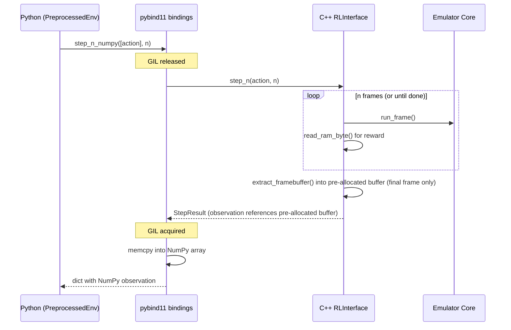

# Design Document: Training Performance

## Overview

This design addresses the 6× throughput gap between the raw C++ emulator (206 fps) and end-to-end training (35 fps). The 70% overhead lives in the Python/SB3 layer: per-frame Python↔C++ round-trips, GIL contention, observation copies, and single-process data collection. The C++ side has its own hotspots — per-frame `std::vector` allocations in `extract_framebuffer()` and `read_ram()`, and the VDC simulation dominating `run_frame()`.

The optimization strategy has three tiers:

1. **Reduce Python↔C++ round-trips**: `step_n()` batching, frame skip in C++, vectorized environments via `SubprocVecEnv`
2. **Eliminate hot-path allocations**: pre-allocated framebuffer, single-byte RAM reads, zero-copy observation return
3. **Reduce per-frame work**: RAM-based observations (skip VDC entirely), configurable resolution, mixed precision training, PGO builds

All changes are designed to be emulator-agnostic — the `RLInterface` base class gets the new methods, and each emulator adapter implements them.

## Architecture

```mermaid
graph TD
    subgraph "Training Pipeline (Python)"
        TP[TrainingPipeline] --> VE{num_envs > 1?}
        VE -->|Yes| SPV[SubprocVecEnv]
        VE -->|No| SE[Single Env]
        SPV --> W1[Worker 1: BaseEnv → PreprocessedEnv → GymnasiumWrapper]
        SPV --> W2[Worker 2: BaseEnv → PreprocessedEnv → GymnasiumWrapper]
        SPV --> WN[Worker N: ...]
        SE --> GW[BaseEnv → PreprocessedEnv → GymnasiumWrapper]
    end

    subgraph "C++ RLInterface"
        SI[step_n&#40;action, n&#41;] --> RF[run_frame × n]
        RF --> EF{observation_mode}
        EF -->|framebuffer| FB[Pre-allocated RGB buffer]
        EF -->|ram| RB[RAM byte array]
        SI --> RW[read_ram_byte&#40;addr&#41; for rewards]
    end

    subgraph "SB3 Model"
        MP{mixed_precision?}
        MP -->|Yes| AMP[torch.cuda.amp.autocast]
        MP -->|No| FP32[Standard FP32]
    end

    W1 --> SI
    GW --> SI
```



### Data Flow (Optimized Hot Path)



## Components and Interfaces

### 1. RLInterface Base Class Changes

```cpp
// New methods added to RLInterface (include/retro_ai/rl_interface.hpp)

class RLInterface {
public:
    // ... existing methods ...

    // Step N frames with the same action, return final observation + accumulated reward.
    // Default implementation calls step() N times.
    virtual StepResult step_n(const std::vector<int>& action, int n) {
        StepResult result;
        float total_reward = 0.0f;
        for (int i = 0; i < n; ++i) {
            result = step(action);
            total_reward += result.reward;
            if (result.done || result.truncated) break;
        }
        result.reward = total_reward;
        return result;
    }

    // Read a single byte from emulator RAM without allocation.
    // Returns 0 for out-of-range addresses. Default returns 0.
    virtual uint8_t read_ram_byte(uint16_t address) const { return 0; }

    // Return RAM size for RAM-based observation space.
    virtual int ram_size() const { return 0; }

    // Return RAM contents as observation (flat byte vector).
    virtual std::vector<uint8_t> read_ram_observation() const { return read_ram(); }
};
```

### 2. VideopacRLInterface Changes

```cpp
class VideopacRLInterface::Impl {
    // Pre-allocated framebuffer (Requirement 4)
    std::vector<uint8_t> rgb_buffer_;  // allocated once in constructor

    // Constructor: rgb_buffer_(kFramebufferSize) in initializer list

    // Optimized extract_framebuffer writes into rgb_buffer_ in-place
    const std::vector<uint8_t>& extract_framebuffer() {
        const uint8_t* indexed_fb = emulator_->get_framebuffer();
        for (int i = 0; i < kScreenWidth * kScreenHeight; ++i) {
            uint8_t idx = indexed_fb[i] & 0x0F;
            const auto& c = PALETTE_STANDARD[idx];
            rgb_buffer_[i * 3 + 0] = c.r;
            rgb_buffer_[i * 3 + 1] = c.g;
            rgb_buffer_[i * 3 + 2] = c.b;
        }
        return rgb_buffer_;
    }

    // Single-byte RAM read (Requirement 5)
    uint8_t read_ram_byte(uint16_t address) const {
        if (address < 64) {
            return emulator_->get_cpu_state().ram[address];
        }
        if (address < 192) {
            return emulator_->get_memory_state().external_ram[address - 64];
        }
        return 0;
    }

    // Optimized step_n: skip intermediate framebuffer extraction (Requirement 11)
    StepResult step_n(const std::vector<int>& action, int n) {
        // validate action...
        float total_reward = 0.0f;
        bool done = false;
        for (int i = 0; i < n; ++i) {
            apply_action(action[0]);
            emulator_->run_frame();
            clear_input();
            ++frame_number_;
            // Compute reward without framebuffer extraction
            if (reward_system_) {
                // reward system uses read_ram_byte, not extract_framebuffer
                total_reward += compute_frame_reward();
            }
            done = is_timer_expired();
            if (done) break;
        }
        // Extract framebuffer only for the final frame
        StepResult result;
        result.observation = extract_framebuffer_copy();  // or reference
        result.reward = total_reward;
        result.done = done;
        result.truncated = false;
        result.info = "{\"frame_number\": " + std::to_string(frame_number_) + "}";
        return result;
    }
};
```

### 3. MemoryRewardSystem Wire-up Fix

The current `wire_memory_reward_system()` captures a lambda that calls `read_ram()` (allocates 192-byte vector) every frame. The fix:

```cpp
// Before (allocates every call):
mem_reward->set_memory_reader([this](uint16_t addr) -> uint8_t {
    auto ram = read_ram();  // allocates std::vector<uint8_t>(192)
    if (addr < ram.size()) return ram[addr];
    return 0;
});

// After (zero allocation):
mem_reward->set_memory_reader([this](uint16_t addr) -> uint8_t {
    return read_ram_byte(addr);
});
```

### 4. pybind11 Bindings Extensions

```cpp
// New bindings for step_n and read_ram_byte
.def("step_n", [](RLInterface& self, const std::vector<int>& action, int n) {
    StepResult result;
    {
        py::gil_scoped_release release;
        result = self.step_n(action, n);
    }
    return result;
}, py::arg("action"), py::arg("n"))

.def("step_n_numpy", [](RLInterface& self, const std::vector<int>& action, int n) {
    StepResult result;
    {
        py::gil_scoped_release release;
        result = self.step_n(action, n);
    }
    return step_result_to_dict(result, self.observation_space());
}, py::arg("action"), py::arg("n"))

.def("read_ram_byte", &RLInterface::read_ram_byte, py::arg("address"))
.def("ram_size", &RLInterface::ram_size)
```

### 5. TrainingPipeline Vectorized Environment Support

```python
# pipeline.py changes
from stable_baselines3.common.vec_env import SubprocVecEnv, DummyVecEnv

def _build_env(self):
    num_envs = self.config.num_envs  # new config field, default 1

    def make_env(rank):
        def _init():
            base = BaseEnv(...)
            pipeline = PreprocessingPipeline(...)
            preprocessed = PreprocessedEnv(base, pipeline)
            env = GymnasiumWrapper(preprocessed)
            if self._game_profile and self._game_profile.startup_sequence:
                env = StartupSequenceWrapper(env, self._game_profile.startup_sequence)
            return env
        return _init

    if num_envs == 1:
        return make_env(0)()  # no subprocess overhead
    else:
        return SubprocVecEnv([make_env(i) for i in range(num_envs)])
```

### 6. BaseEnv Observation Mode Support

```python
class BaseEnv:
    def __init__(self, ..., observation_mode: str = "framebuffer"):
        self._observation_mode = observation_mode
        # ...

    def step(self, action):
        if self._observation_mode == "ram":
            result = self._interface.step_numpy([action])
            # Replace observation with RAM bytes
            ram_bytes = self._interface.read_ram()
            observation = np.frombuffer(ram_bytes, dtype=np.uint8)
        else:
            result = self._interface.step_numpy([action])
            observation = result["observation"]
        # ...
```

### 7. PreprocessedEnv with step_n Integration

When `frame_skip > 1` and the underlying interface supports `step_n`, `PreprocessedEnv` delegates to `step_n` instead of calling `step()` in a Python loop:

```python
class PreprocessedEnv:
    def step(self, action):
        if self.preprocessing.frame_skip > 1 and hasattr(self.env, '_interface'):
            # Use C++ step_n to avoid N Python→C++ round-trips
            result = self.env.step_n(action, self.preprocessing.frame_skip)
            obs, reward, done, truncated, info = result
            processed_obs = self.preprocessing.process(obs)
            return processed_obs, reward, done, truncated, info
        else:
            # Fallback: Python-side frame skip loop (existing behavior)
            ...
```

### 8. CMake PGO Support

```cmake
# New options in CMakeLists.txt
option(PGO_GENERATE "Build with PGO instrumentation" OFF)
option(PGO_USE "Build using PGO profile data" OFF)

if(PGO_GENERATE)
    if(CMAKE_CXX_COMPILER_ID MATCHES "GNU")
        add_compile_options(-fprofile-generate=${CMAKE_BINARY_DIR}/pgo-data)
        add_link_options(-fprofile-generate=${CMAKE_BINARY_DIR}/pgo-data)
    elseif(CMAKE_CXX_COMPILER_ID MATCHES "Clang")
        add_compile_options(-fprofile-instr-generate=${CMAKE_BINARY_DIR}/pgo-data/default.profraw)
        add_link_options(-fprofile-instr-generate=${CMAKE_BINARY_DIR}/pgo-data/default.profraw)
    endif()
elseif(PGO_USE)
    if(CMAKE_CXX_COMPILER_ID MATCHES "GNU")
        add_compile_options(-fprofile-use=${CMAKE_BINARY_DIR}/pgo-data -fprofile-correction)
        add_link_options(-fprofile-use=${CMAKE_BINARY_DIR}/pgo-data)
    elseif(CMAKE_CXX_COMPILER_ID MATCHES "Clang")
        add_compile_options(-fprofile-instr-use=${CMAKE_BINARY_DIR}/pgo-data/default.profdata)
        add_link_options(-fprofile-instr-use=${CMAKE_BINARY_DIR}/pgo-data/default.profdata)
    endif()
endif()
```

### 9. Mixed Precision Training

```python
# pipeline.py: _build_model changes
def _build_model(self, env):
    algo_cls = ALGORITHM_MAP[self.config.algorithm.name]
    kwargs = { ... }

    if self.config.mixed_precision:
        import torch
        if torch.cuda.is_available():
            kwargs["policy_kwargs"] = kwargs.get("policy_kwargs", {})
            kwargs["policy_kwargs"]["optimizer_kwargs"] = {"fused": True}
            # SB3 doesn't natively support AMP, so we wrap via custom policy
            # or use torch.set_float32_matmul_precision('medium')
        else:
            self._logger.warning("mixed_precision enabled but no CUDA GPU available, using FP32")
```

### 10. Profiling Infrastructure

A C++ benchmark that instruments `run_frame()` components using `std::chrono`:

```cpp
// scripts/bench_components.cpp or exposed via pybind11
struct FrameTimings {
    double cpu_us;
    double vdc_us;
    double framebuffer_us;
    double reward_us;
    double total_us;
};
```

Exposed to Python so `scripts/bench_step.py` can report per-component breakdowns.

## Data Models

### TrainingConfig Extensions

```python
@dataclass
class TrainingConfig:
    # ... existing fields ...

    # New performance fields
    num_envs: int = 1                          # Requirement 2
    observation_mode: str = "framebuffer"       # Requirement 6: "framebuffer" | "ram"
    mixed_precision: bool = False               # Requirement 8
```

### Game Profile YAML Schema Extensions

```yaml
# New optional fields in game profile YAML
frame_skip: 4                    # Requirement 3: recommended frame skip (1-16)
frame_skip_rationale: "..."      # Requirement 3: why this value
observation_mode: framebuffer    # Requirement 6: "framebuffer" or "ram"
resize: [84, 84]                 # Requirement 7: recommended resolution
resize_rationale: "..."          # Requirement 7: why this resolution
```

### StepResult (unchanged structure, changed semantics)

The `StepResult.observation` field continues to be `std::vector<uint8_t>`. The pre-allocated buffer optimization is internal to the Impl class — `step()` copies from the pre-allocated buffer into the returned `StepResult.observation` to maintain the existing ownership semantics. The `step_n()` method does the same but only for the final frame.

For the RAM observation mode, `StepResult.observation` contains the flat RAM bytes instead of RGB pixels, and `ObservationSpace` is adjusted:

```cpp
ObservationSpace observation_space() const {
    if (observation_mode_ == "ram") {
        return {ram_size(), 1, 1, 8};  // 1D: (ram_size, 1, 1)
    }
    return {kScreenWidth, kScreenHeight, kScreenChannels, 8};
}
```

### Benchmark Output Schema

```json
{
    "timestamp": "2025-01-15T10:30:00Z",
    "game_profile": "course_automobile",
    "num_envs": 4,
    "frame_skip": 4,
    "observation_mode": "framebuffer",
    "resize": [84, 84],
    "total_timesteps": 10000,
    "wall_clock_seconds": 28.5,
    "fps": 350.9,
    "component_timings": {
        "emulator_step_ms": 4.8,
        "reward_ms": 0.01,
        "preprocessing_ms": 0.5,
        "model_inference_ms": 2.1
    }
}
```


## Correctness Properties

*A property is a characteristic or behavior that should hold true across all valid executions of a system — essentially, a formal statement about what the system should do. Properties serve as the bridge between human-readable specifications and machine-verifiable correctness guarantees.*

### Property 1: Profiling output percentages sum correctly

*For any* set of per-component timing measurements (CPU, VDC, framebuffer, reward), the formatted profiling output shall contain percentage values that sum to 100% (within floating-point tolerance) and each absolute timing shall be non-negative.

**Validates: Requirements 1.3**

### Property 2: Vectorized environment construction matches num_envs

*For any* `num_envs` value greater than 1, the constructed environment shall be a `SubprocVecEnv` with exactly `num_envs` sub-environments. For `num_envs` equal to 1, the result shall be a single unwrapped environment (not a `SubprocVecEnv`).

**Validates: Requirements 2.1, 2.2, 2.3**

### Property 3: Batch size invariant under vectorization

*For any* `num_envs` and base `n_steps` configuration, the effective batch size (`num_envs × adjusted_n_steps`) shall equal the configured target batch size, ensuring training dynamics remain consistent regardless of parallelism.

**Validates: Requirements 2.4**

### Property 4: Frame skip range validation

*For any* integer value for `frame_skip`, values in [1, 16] shall be accepted by `PreprocessedEnv`, and values outside that range shall be rejected.

**Validates: Requirements 3.1**

### Property 5: Frame skip reward accumulation

*For any* action and frame skip value N, the reward returned by `PreprocessedEnv.step()` with `frame_skip=N` shall equal the sum of rewards from N individual `BaseEnv.step()` calls with the same action (when no early termination occurs). When the episode terminates at frame k < N, the accumulated reward shall equal the sum of rewards for frames 1 through k.

**Validates: Requirements 3.2, 3.3**

### Property 6: Framebuffer pixel equivalence after optimization

*For any* emulator state, the RGB framebuffer produced by the optimized `extract_framebuffer()` (writing into a pre-allocated buffer) shall be pixel-for-pixel identical to the output of the original implementation (allocating a new vector each call).

**Validates: Requirements 4.4**

### Property 7: read_ram_byte equivalence with read_ram

*For any* valid RAM address in [0, 191], `read_ram_byte(addr)` shall return the same value as `read_ram()[addr]`. For any address >= 192, `read_ram_byte(addr)` shall return 0.

**Validates: Requirements 5.1, 5.4**

### Property 8: RAM observation correctness

*For any* emulator state when `observation_mode` is `"ram"`, the observation returned by `step()` shall be a 1-D uint8 array of length equal to `ram_size()`, and each byte shall equal the corresponding byte from `read_ram()`.

**Validates: Requirements 6.2, 6.3**

### Property 9: Resize produces correct output dimensions

*For any* input framebuffer of dimensions (H, W, C) and any target resolution (h, w) where h > 0 and w > 0, the resized output shall have shape (h, w, C). Each output pixel at (r, c) shall equal the source pixel at (r × H // h, c × W // w) — nearest-neighbor correctness.

**Validates: Requirements 7.2**

### Property 10: Low resolution warning threshold

*For any* resize value where height < 42 or width < 42, the Training_Pipeline shall emit a warning log. For resize values where both dimensions are >= 42, no such warning shall be emitted.

**Validates: Requirements 7.4**

### Property 11: step_n reward equivalence with sequential steps

*For any* action and frame count N, calling `step_n(action, N)` from the same emulator state shall produce a reward equal to the sum of N sequential `step(action)` calls from that same state (when no early termination occurs). When early termination occurs at frame k < N, the result shall have `done=true` and reward equal to the sum of k steps.

**Validates: Requirements 11.1, 11.2**

### Property 12: step() is equivalent to step_n(action, 1)

*For any* action and emulator state, `step(action)` shall produce an identical `StepResult` (observation, reward, done, truncated) to `step_n(action, 1)`.

**Validates: Requirements 11.4**

### Property 13: Benchmark output is valid JSON

*For any* benchmark run with valid parameters, the output shall be parseable as valid JSON containing at minimum the keys: `fps`, `wall_clock_seconds`, `total_timesteps`.

**Validates: Requirements 10.4**

## Error Handling

| Scenario | Component | Behavior |
|---|---|---|
| `num_envs` < 1 | TrainingConfig validation | Raise `ConfigurationError` |
| `frame_skip` outside [1, 16] | PreprocessedEnv constructor | Raise `ValueError` |
| `observation_mode` not in {"framebuffer", "ram"} | BaseEnv constructor | Raise `ValueError` |
| `read_ram_byte()` with address >= RAM size | VideopacRLInterface | Return 0 (no error) |
| `step_n()` with n < 1 | RLInterface | Return current state with 0 reward |
| `step_n()` with invalid action | VideopacRLInterface | Return truncated StepResult (same as `step()`) |
| Subprocess env crash in SubprocVecEnv | TrainingPipeline | Log error, SB3 handles restart |
| `mixed_precision=true` without CUDA | TrainingPipeline | Log warning, fall back to FP32 |
| PGO profile data missing when `PGO_USE=ON` | CMake | Compiler warning/error at build time |
| Benchmark script given invalid game profile | bench_training.py | Exit with error message |

## Testing Strategy

### Property-Based Testing

Use **Hypothesis** (Python) for property-based tests. Each property test runs a minimum of 100 iterations.

Properties to implement as PBT:

| Property | Test Target | Generator Strategy |
|---|---|---|
| P1: Profiling percentages | `format_timings()` | Random positive floats for component times |
| P3: Batch size invariant | `compute_n_steps()` | Random num_envs ∈ [1, 32], base_batch ∈ [64, 4096] |
| P4: Frame skip range | `PreprocessedEnv.__init__()` | Random ints, partitioned into valid [1,16] and invalid |
| P5: Frame skip reward | `PreprocessedEnv.step()` | Random reward sequences, random frame_skip ∈ [1, 16] |
| P6: Framebuffer equivalence | `extract_framebuffer()` | Random palette-indexed framebuffers (160×240, values 0-15) |
| P7: read_ram_byte equiv | `read_ram_byte()` vs `read_ram()` | Random addresses ∈ [0, 255], random RAM contents |
| P8: RAM observation | `step()` with observation_mode="ram" | Random emulator states |
| P9: Resize correctness | `_process_single_frame()` | Random images, random target resolutions |
| P11: step_n equivalence | `step_n()` vs sequential `step()` | Random actions, random n ∈ [1, 16] |
| P12: step vs step_n(1) | `step()` vs `step_n(action, 1)` | Random actions |
| P13: Benchmark JSON | `format_benchmark_output()` | Random timing data |

Each test is tagged: `# Feature: training-performance, Property {N}: {title}`

### Unit Tests

Unit tests cover specific examples, edge cases, and integration points:

- `num_envs=1` produces unwrapped env (edge case from P2)
- `num_envs=4` produces SubprocVecEnv with 4 envs (example from P2)
- Frame skip early termination at frame 2 of 4 (edge case from P5)
- `read_ram_byte(192)` returns 0 (edge case from P7)
- `observation_mode="ram"` selects MlpPolicy (example from Req 6.4)
- `mixed_precision=true` without GPU logs warning (example from Req 8.3)
- PGO CMake options produce correct compiler flags for GCC and Clang (examples from Req 9.1, 9.2)
- Benchmark script accepts all parameter combinations (example from Req 10.3)
- `resize=(30, 30)` triggers low-resolution warning (edge case from P10)

### Testing Libraries

- **Python**: `pytest` + `hypothesis` for property-based tests
- **C++**: `Catch2` (already in use) for unit tests of `read_ram_byte()`, `step_n()`, `extract_framebuffer()`
- C++ property tests can use Catch2's `GENERATE` with random seeds, or a dedicated PBT library like `rapidcheck` if needed

### Test Configuration

```python
# Hypothesis settings for property tests
from hypothesis import settings

@settings(max_examples=200, deadline=None)
def test_property_N(...):
    ...
```
